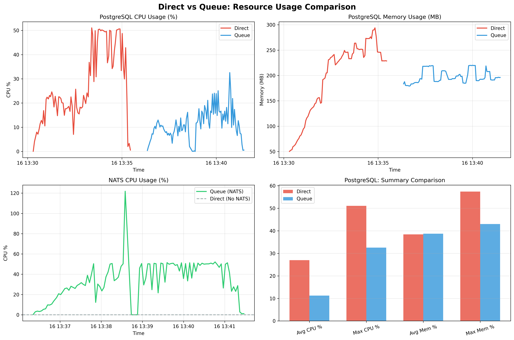

# Load Test Results: Direct vs Queue Approach

## Test Configuration
- **Duration**: 5 minutes
- **Peak Load**: 3000 concurrent users
- **Total Requests**: ~413,000

## 📊 Resource Usage Comparison

### PostgreSQL (exam-db)

| Metric | Direct Approach | Queue Approach | Difference |
|--------|----------------|----------------|------------|
| **Avg CPU** | 26.97% | 11.25% | -15.73% |
| **Max CPU** | 51.05% | 32.56% | -18.49% |
| **Avg Memory** | 197 MB | 198 MB | +1 MB |
| **Max Memory** | 294 MB | 220 MB | -74 MB |
| **Avg Mem %** | 38.41% | 38.70% | +0.28% |

### NATS (exam-nats) - Queue Only

| Metric | Value |
|--------|-------|
| **Avg CPU** | 33.60% |
| **Max CPU** | 121.85% |
| **Avg Memory** | 30 MB |
| **Max Memory** | 46 MB |

## 🎯 Key Insights

### Direct Approach
- ✅ Lower latency (direct write to database)
- ⚠️ Higher database load during peaks
- ⚠️ No buffering - all requests hit DB immediately

### Queue Approach
- ✅ Decoupled - API responds faster
- ✅ Smoother database load (batched writes)
- ✅ Better resilience (messages queued if DB slow)
- ⚠️ Additional component (NATS) to manage
- ⚠️ Small overhead from message passing

## 📈 Visualization

---
*Generated automatically from load test results*
