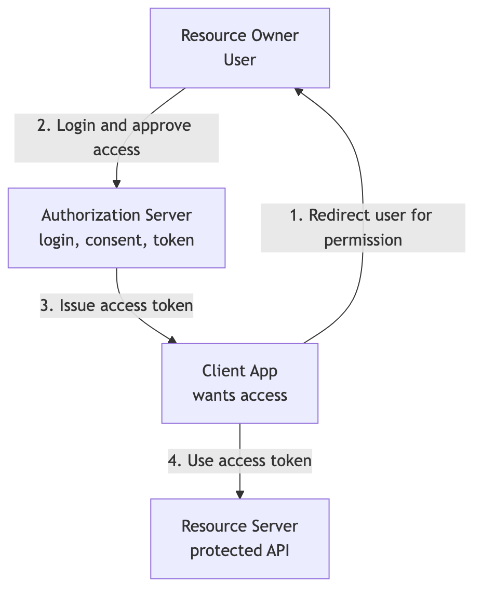
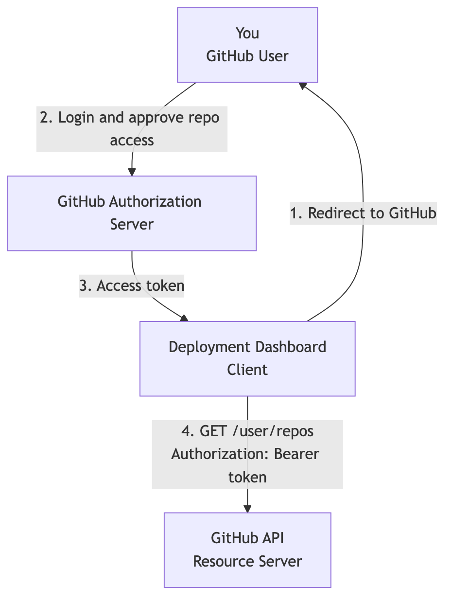

```{=latex}
\makelessoncover{1}{OAuth 2.0: The Problem, Actors, and Endpoints}
```

# Learning Goal

This lesson explains the first mental model of OAuth 2.0:

> OAuth lets a client get limited permission to access a resource server, usually on behalf of a user, without ever receiving the user's password.

After this lesson, you should be able to:

- Define OAuth 2.0 as an authorization framework.
- Explain the difference between OAuth as a framework, RFCs as standards, and flows as ways to use the framework.
- Explain why OAuth exists.
- Explain why password sharing is dangerous.
- Identify the four OAuth actors in a scenario.
- Identify the main OAuth endpoints.
- Explain access tokens, scopes, and consent at a beginner level.
- Separate OAuth from OpenID Connect when discussing login.

# 1. What OAuth 2.0 Is

OAuth 2.0 is an **authorization framework**.

It is not just one flow, one API, one token format, or one login method.

More precisely:

> OAuth 2.0 is an RFC-defined authorization framework that lets a client get limited access to protected resources using tokens.

OAuth is mainly about this question:

> What is this client allowed to access?

It is not mainly about this question:

> Who is this user?

That second question is authentication. For login and identity, the related standard is usually OpenID Connect.

## Framework, Standard, and Flow

People use the word "OAuth" in several ways.

| Term | Meaning | Example |
|---|---|---|
| Framework | The overall authorization model. | Clients, tokens, scopes, grants, endpoints, and protected APIs. |
| Standard / RFC | The official technical specification. | RFC 6749 defines the OAuth 2.0 Authorization Framework. |
| Flow / Grant Type | A specific way to get tokens. | Authorization Code, Client Credentials, Refresh Token, Device Authorization. |
| Token-based access pattern | How APIs receive proof of access. | Client calls API with `Authorization: Bearer access_token`. |

Simple sentence:

> OAuth is the framework. RFCs define the framework. Flows are ways to use the framework.

## What OAuth Is Not

OAuth is not:

- A password sharing system.
- A single API endpoint.
- A single token format.
- A methodology like Agile or Scrum.
- A complete login protocol by itself.
- A guarantee that a system is secure automatically.

OAuth can be implemented securely or poorly. The flow, token handling, redirect validation, client type, and storage choices all matter.

# 2. The Problem OAuth Solves

Modern applications often need to connect to other systems.

For example:

- A deployment dashboard wants to access your GitHub repositories.
- Canva wants to import files from Google Drive.
- Notion wants to read or create Google Calendar events.
- A Slack bot wants to post messages in a workspace.
- A finance app wants to read a bank account balance.

The unsafe solution is password sharing.

For example, a third-party app might ask:

> "Give me your GitHub username and password so I can access your repositories."

That is dangerous because the app receives too much power. It may be able to access everything the user can access, not only the specific resource it needs.

OAuth provides a safer pattern:

1. The user goes to the trusted service.
2. The trusted service authenticates the user.
3. The trusted service asks whether the client should receive limited access.
4. The client receives an access token.
5. The client uses the access token to call the protected API.

The important point is:

> The client receives permission, not the user's password.

# 3. Why Password Sharing Is Bad

Password sharing creates several problems:

- The third-party app can see and store the user's password.
- The app may receive more access than it actually needs.
- The user cannot easily limit access to one resource or one action.
- The user cannot safely revoke only that app's access without changing the password.
- If the third-party app is compromised, the original account is exposed.

OAuth improves this by giving the client a limited token instead of a password.

That token can be scoped, expired, revoked, and validated by the API.

# 4. Main Example: Connecting an App to GitHub

Imagine a deployment dashboard that wants to list repositories from your GitHub account.

Without OAuth, the dashboard might ask for your GitHub username and password. That is unsafe because the dashboard could gain broad access to your GitHub account.

With OAuth, the flow is safer:

1. You click **Connect GitHub** in the deployment dashboard.
2. The dashboard redirects you to GitHub.
3. You log in directly on GitHub.
4. GitHub asks whether you allow the dashboard to access selected repositories or permissions.
5. You approve.
6. GitHub issues an access token to the dashboard.
7. The dashboard uses that access token to call the GitHub API.

Example API request:

```http
GET /user/repos
Authorization: Bearer access_token
```

The dashboard does not need your GitHub password. It only needs an access token with the right permission.

# 5. The Four OAuth Actors

OAuth has four main actors.

| Actor | Meaning | GitHub Example |
|---|---|---|
| Resource Owner | The person or entity that owns the protected resource. | You, the GitHub user. |
| Client | The application that wants access. | The deployment dashboard. |
| Authorization Server | The server that authenticates the user, asks for consent, and issues tokens. | GitHub's authorization server. |
| Resource Server | The API that hosts the protected resource and validates access tokens. | GitHub API. |

A simple way to identify the actors is to ask:

- Who owns the data?
- Who wants access?
- Who grants and issues permission?
- Who serves the protected API?

# 6. OAuth Endpoints

Endpoints are URLs exposed by the authorization server.

For this first lesson, the two most important endpoints are:

| Endpoint | Purpose |
|---|---|
| Authorization endpoint | Where the user is redirected to authenticate and approve access. |
| Token endpoint | Where the client exchanges a grant, such as an authorization code, for an access token. |

Other endpoints may also appear:

| Endpoint | Purpose |
|---|---|
| Metadata endpoint | Describes server configuration, endpoint URLs, supported scopes, and signing keys. |
| Revocation endpoint | Lets a client or system revoke a token. |
| Introspection endpoint | Lets a resource server or client check the status of an opaque token. |

In later lessons, the authorization code flow will show exactly how the authorization endpoint and token endpoint work together.

# 7. Access Tokens, Scopes, and Consent

## Access Token

The access token is the credential the client uses when calling the resource server.

For example:

```http
GET /repos
Authorization: Bearer access_token
```

The resource server checks whether the token is valid and whether it grants enough permission for the requested action.

Important:

> The access token represents permission. It is not the user's password.

## Scopes

Scopes describe the type of access requested or granted.

Example scopes:

- `repo:read`
- `repo:write`
- `read:calendar`
- `write:message`
- `read:balance`

A client should ask only for the minimum permission it needs. This is called **least privilege**.

## Consent

Consent is the approval step where the user or administrator allows the client to receive specific access.

Example:

> "Deployment Dashboard wants to access selected GitHub repositories."

The user can approve or deny.

Consent is common in user-delegated OAuth flows. It may not appear in machine-to-machine flows.

# 8. Public and Confidential Clients

OAuth clients can be public or confidential.

| Client Type | Meaning | Examples |
|---|---|---|
| Public client | Cannot safely keep a secret because code or storage is exposed to the user environment. | Browser SPA, mobile app, CLI. |
| Confidential client | Can keep a client secret or private key on a backend server. | Server-side web app, backend service. |

This distinction matters because confidential clients can authenticate to the token endpoint with a secret or private key.

Public clients cannot safely store a secret. They need protections such as PKCE, which is covered in a later lesson.

# 9. OAuth vs OpenID Connect

This lesson should also prevent one common confusion:

> OAuth is for delegated API access. OpenID Connect is for login and identity.

| Topic | OAuth 2.0 | OpenID Connect |
|---|---|---|
| Main purpose | Authorization | Authentication |
| Main question | What can this client access? | Who is the user? |
| Main token | Access token | ID token |
| Common example | Connect GitHub repositories or Google Drive files. | Login with Google. |

Use this rule:

> If the app wants to access an API, think OAuth. If the app wants to know who the user is, think OpenID Connect.

Examples:

| Scenario | Better Label |
|---|---|
| App logs user in with Google. | OpenID Connect |
| App reads Google Calendar. | OAuth |
| App logs user in and reads Google Calendar. | OpenID Connect + OAuth |
| App connects to GitHub repositories. | OAuth |
| App initiates a bank payment. | OAuth or an open banking OAuth profile |

Login with Google is usually OpenID Connect because the app wants user identity.

Connecting Google Calendar, Google Drive, GitHub repositories, or Slack APIs is OAuth because the app wants API access.

Some products do both: they sign the user in and ask for API permissions.

# 10. Five Examples Where OAuth Is Better Than Password Sharing

| Example | Why OAuth Is Better |
|---|---|
| Deployment dashboard connects to GitHub. | The dashboard can get limited repository access without seeing the GitHub password. |
| Canva imports files from Google Drive. | Canva can request file access without controlling the whole Google account. |
| Notion connects to Google Calendar. | Notion can read or create calendar events with limited permission. |
| Slack bot posts messages to a workspace. | The bot receives approved workspace permissions instead of a human password. |
| Finance app reads bank balance. | The app can receive read-only access instead of full bank login access. |

The key pattern:

> OAuth gives limited, revocable, scoped access. Passwords give too much power.

# 11. Actor Mapping Examples

## Connect GitHub Repositories

| OAuth Actor | In This Scenario |
|---|---|
| Resource Owner | GitHub user |
| Client | Deployment dashboard |
| Authorization Server | GitHub authorization server |
| Resource Server | GitHub API |

## Login with Google

| OAuth/OIDC Actor | In This Scenario |
|---|---|
| User | Person signing in |
| Client | Website or app using "Login with Google" |
| OpenID Provider / Authorization Server | Google |
| Resource Server | Google UserInfo or profile API, if requested |

Note:

> Login with Google is usually OpenID Connect. It is included here because it is a common source of OAuth confusion.

## Open Banking Payment

| OAuth Actor | In This Scenario |
|---|---|
| Resource Owner | Bank customer |
| Client | Merchant app or payment initiation app |
| Authorization Server | Bank authorization server |
| Resource Server | Bank payment API |

## Service-to-Service API

| OAuth Actor | In This Scenario |
|---|---|
| Resource Owner | Usually the organization or system, not a human user |
| Client | Calling backend service |
| Authorization Server | Internal identity or token server |
| Resource Server | Target backend API |

Important:

> In service-to-service OAuth, there may be no user consent screen. The token represents the client or service, not a human user.

# 12. Box Diagram

General OAuth actor diagram:

{width=95%}

GitHub version:

{width=95%}

# 13. Standards and Related Specifications

OAuth 2.0 is defined and extended by several standards. You do not need to memorize all of them in Lesson 1, but it helps to know that OAuth is a standards family, not just a product feature.

- **[RFC 6749: OAuth 2.0 Authorization Framework](https://www.rfc-editor.org/rfc/rfc6749)**  
  Defines OAuth 2.0 roles, grants, endpoints, and the core authorization model.

- **[RFC 6750: Bearer Token Usage](https://www.rfc-editor.org/rfc/rfc6750)**  
  Defines how bearer access tokens are used in HTTP requests.

- **[RFC 8414: Authorization Server Metadata](https://www.rfc-editor.org/rfc/rfc8414)**  
  Defines a discovery document for OAuth server configuration.

- **[RFC 7009: Token Revocation](https://www.rfc-editor.org/rfc/rfc7009)**  
  Defines how tokens can be revoked.

- **[RFC 7662: Token Introspection](https://www.rfc-editor.org/rfc/rfc7662)**  
  Defines how to check an opaque token's status and metadata.

- **[RFC 7636: PKCE](https://www.rfc-editor.org/rfc/rfc7636)**  
  Protects authorization code exchange, especially for public clients.

- **[RFC 9700: OAuth 2.0 Security Best Current Practice](https://www.rfc-editor.org/rfc/rfc9700)**  
  Describes current best practices for OAuth 2.0 security.

- **[OpenID Connect Core 1.0](https://openid.net/specs/openid-connect-core-1_0.html)**  
  Adds an authentication layer and ID tokens on top of OAuth 2.0.

Beginner rule:

> Learn OAuth flows first. Standards references help you check details later.

# 14. Exercise: Is This Authentication or Authorization?

| Scenario | Answer |
|---|---|
| User enters username and password at GitHub. | Authentication |
| GitHub asks whether the app may access selected repositories. | Authorization |
| Client receives an access token. | Authorization |
| GitHub API checks whether the token has enough permission. | Authorization |
| App uses an ID token to identify the signed-in user. | Authentication via OpenID Connect |

# 15. Actor-Mapping Drills

For each scenario, identify:

- Resource Owner
- Client
- Authorization Server
- Resource Server

Scenarios:

1. Canva imports photos from Google Drive.
2. A VS Code extension creates GitHub issues.
3. A Slack bot reads channel messages.
4. A CI pipeline downloads packages from a private registry.
5. A mobile app connects to Fitbit health data.

# 16. Definition of Done

You are ready to move to the next lesson when you can:

- Define OAuth 2.0 as an authorization framework.
- Explain that RFCs define the framework and flows are ways to use it.
- Explain OAuth in two minutes without mentioning JWT.
- Explain why OAuth is better than password sharing.
- Define delegated access.
- Identify Resource Owner, Client, Authorization Server, and Resource Server in a scenario.
- Name the authorization endpoint and token endpoint.
- Explain access tokens, scopes, and consent at a beginner level.
- Explain why Login with Google is usually OpenID Connect, while connecting to an API is OAuth.

# Appendix: Slide Outline

This paper can become a short teaching presentation with this slide flow:

1. OAuth 2.0: The Problem and the Players
2. What OAuth 2.0 is: framework, standard, and flows
3. The password-sharing problem
4. OAuth's core idea: limited delegated access
5. Main example: connecting a deployment dashboard to GitHub
6. The four actors
7. Authorization server endpoints
8. Access tokens, scopes, and consent
9. OAuth vs OpenID Connect
10. Standards and related specifications
11. Actor-mapping exercise
12. Recap and readiness check
