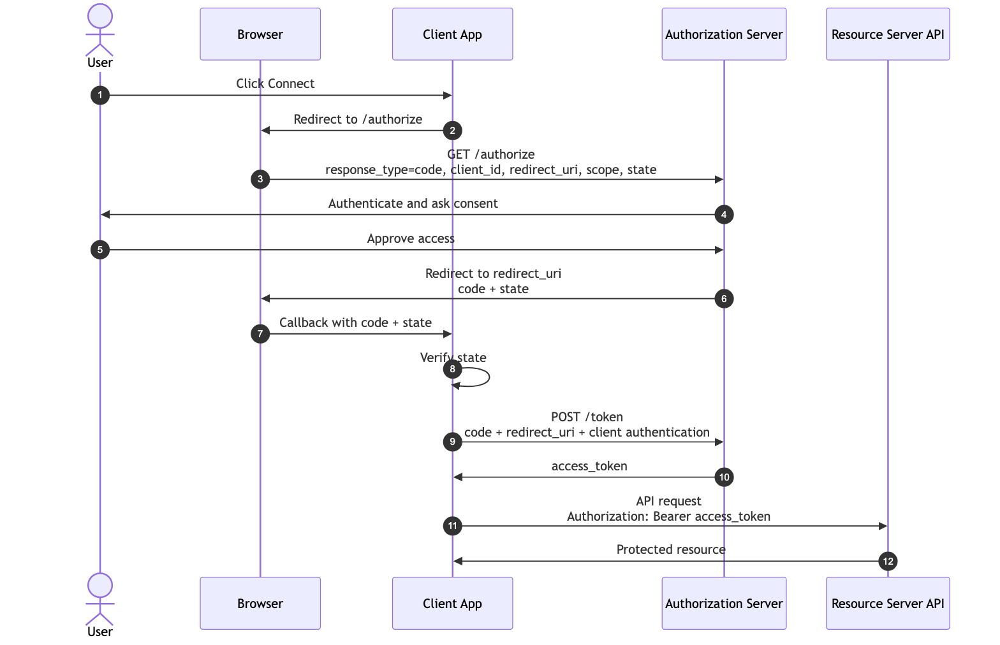
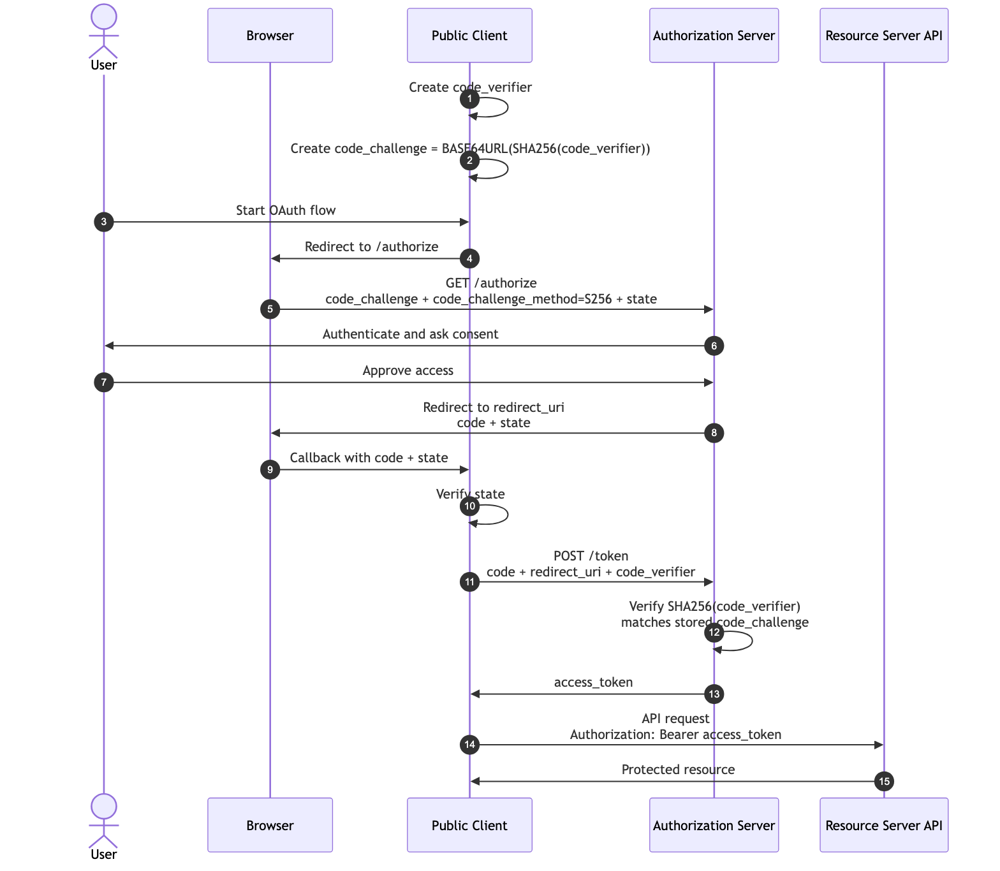

```{=latex}
\makelessoncover{2}{OAuth 2.0: Authorization Code Flow and PKCE}
```

# Learning Goal

This lesson explains the most important user-based OAuth flow:

> Authorization Code Flow lets a client receive a short-lived authorization code through the browser, then exchange that code for tokens through a safer server-to-server request.

Then it adds PKCE:

> PKCE protects the authorization code exchange by proving that the same client that started the flow is the client exchanging the code.

After this lesson, you should be able to:

- Draw Authorization Code Flow from memory.
- Explain which request goes through the browser and which request is back-channel.
- Identify where the authorization code is returned.
- Identify where the access token is returned.
- Explain why PKCE exists.
- Explain `code_verifier`, `code_challenge`, and `code_challenge_method`.
- Compare normal Authorization Code Flow with Authorization Code Flow + PKCE.
- Explain common mistakes such as weak redirect URI validation, missing `state`, and leaking authorization codes.

# 1. Why This Flow Exists

OAuth needs a way for a user to approve access without giving the client the user's password.

The Authorization Code Flow solves this by separating the process into two parts:

1. A **front-channel** step through the browser.
2. A **back-channel** step directly between the client and authorization server.

The browser receives only a short-lived authorization code. The access token is returned later from the token endpoint, normally through a server-to-server request.

That separation matters because browser redirects are more exposed than back-channel server requests.

# 2. Front-Channel vs Back-Channel

| Channel | Meaning | In This Flow |
|---|---|---|
| Front-channel | Communication through the user's browser. | Redirect to authorization endpoint and redirect back with authorization code. |
| Back-channel | Direct server-to-server communication. | Client exchanges authorization code at the token endpoint. |

Teaching rule:

> The authorization code travels through the browser. The access token should come from the token endpoint.

# 3. Authorization Code Flow: Conceptual Steps

Imagine a deployment dashboard wants to access your GitHub repositories.

1. You click **Connect GitHub**.
2. The client redirects your browser to the authorization server.
3. You log in at the authorization server.
4. You approve the requested access.
5. The authorization server redirects back to the client with an authorization code.
6. The client sends the authorization code to the token endpoint.
7. The token endpoint returns an access token.
8. The client uses the access token to call the API.

# 4. Authorization Code Flow Diagram

{width=100%}

# 5. Authorization Request

The authorization request goes to the authorization endpoint through the browser.

Example:

```http
GET /authorize?
  response_type=code&
  client_id=deployment-dashboard&
  redirect_uri=https%3A%2F%2Fdashboard.example.com%2Fcallback&
  scope=repo.read&
  state=random_state_value
```

Important parameters:

| Parameter | Purpose |
|---|---|
| `response_type=code` | Tells the authorization server that the client wants an authorization code. |
| `client_id` | Identifies the client application. |
| `redirect_uri` | Where the authorization server sends the browser after approval or denial. |
| `scope` | The permissions requested by the client. |
| `state` | A random value used to connect the response to the request and reduce CSRF risk. |

# 6. Authorization Response

After the user approves, the authorization server redirects the browser back to the client's redirect URI.

Example:

```http
GET https://dashboard.example.com/callback?
  code=AUTHORIZATION_CODE&
  state=random_state_value
```

Important:

- The authorization code is short-lived.
- The authorization code is not the access token.
- The client must verify that the returned `state` matches the original `state`.
- The client must exchange the code at the token endpoint.

# 7. Token Request

The token request is sent from the client to the token endpoint.

For a confidential web client, the client may authenticate with a client secret or private key.

Example:

```http
POST /token
Content-Type: application/x-www-form-urlencoded
Authorization: Basic base64(client_id:client_secret)

grant_type=authorization_code&
code=AUTHORIZATION_CODE&
redirect_uri=https%3A%2F%2Fdashboard.example.com%2Fcallback
```

Important parameters:

| Parameter | Purpose |
|---|---|
| `grant_type=authorization_code` | Tells the token endpoint which grant is being used. |
| `code` | The short-lived authorization code. |
| `redirect_uri` | Must match the redirect URI used in the authorization request. |
| Client authentication | Proves the identity of a confidential client. |

# 8. Token Response

Example:

```json
{
  "access_token": "eyJ...",
  "token_type": "Bearer",
  "expires_in": 3600,
  "scope": "repo.read",
  "refresh_token": "optional_refresh_token"
}
```

Important:

- The access token is returned from the token endpoint, not directly from the browser redirect.
- The resource server receives the access token when the client calls the API.
- The resource server must validate the token before accepting the request.

# 9. What Can Go Wrong?

| Problem | Why It Matters | Mitigation |
|---|---|---|
| Redirect URI mismatch or weak matching | An attacker may redirect codes to a location they control. | Require exact redirect URI matching. |
| Missing or unchecked `state` | The client may accept an injected authorization response. | Generate, store, and verify `state`. |
| Authorization code leak | A code in browser history, logs, or referrers may be stolen. | Keep codes short-lived and single-use; use PKCE. |
| Client secret in a public app | Mobile apps, SPAs, and CLIs cannot safely keep secrets. | Treat them as public clients and use PKCE. |
| Token returned through browser | Browser-exposed tokens are easier to leak. | Use Authorization Code Flow, not implicit-style token delivery. |

# 10. Why PKCE Exists

PKCE stands for **Proof Key for Code Exchange**.

It was created to protect the authorization code exchange, especially for public clients such as:

- Mobile apps
- Browser-based single-page apps
- CLI tools
- Desktop apps

Public clients cannot safely keep a client secret. If an attacker steals the authorization code, the attacker may try to exchange it for tokens.

PKCE adds a proof:

> The client that exchanges the code must prove it knows the original secret value that was created before the authorization request.

# 11. PKCE Terms

| Term | Meaning |
|---|---|
| `code_verifier` | A high-entropy random string generated by the client. It is kept by the client until the token request. |
| `code_challenge` | A transformed version of the `code_verifier`, usually a SHA-256 hash encoded with base64url. |
| `code_challenge_method` | The method used to create the challenge. Modern clients should use `S256`. |

Simple explanation:

> The client sends the lock shape first (`code_challenge`) and later proves it has the original key (`code_verifier`).

# 12. Authorization Code Flow with PKCE Diagram

{width=100%}

# 13. PKCE Request Parameters

In the authorization request, the client sends the challenge.

```http
GET /authorize?
  response_type=code&
  client_id=mobile-app&
  redirect_uri=com.example.app%3A%2F%2Fcallback&
  scope=repo.read&
  state=random_state_value&
  code_challenge=BASE64URL_SHA256_CODE_VERIFIER&
  code_challenge_method=S256
```

In the token request, the client sends the original verifier.

```http
POST /token
Content-Type: application/x-www-form-urlencoded

grant_type=authorization_code&
code=AUTHORIZATION_CODE&
redirect_uri=com.example.app%3A%2F%2Fcallback&
code_verifier=ORIGINAL_RANDOM_CODE_VERIFIER
```

The authorization server checks:

1. Does the authorization code exist?
2. Is the authorization code still valid?
3. Was the code already used?
4. Does the `redirect_uri` match?
5. Does the `code_verifier` match the original `code_challenge`?

If the verifier does not match, the token request fails.

# 14. Why Not Just Use `state` or `redirect_uri`?

`state`, `redirect_uri`, and PKCE are all useful, but they do different jobs.

| Check | Checked By | Secret? | Main Purpose |
|---|---|---|---|
| `state` | Client app | Yes, but client-side | Helps the client reject callbacks it did not start. |
| `redirect_uri` | Authorization server | No | Binds the authorization code to the redirect URI used in the original authorization request. |
| `code_verifier` / `code_challenge` | Authorization server token endpoint | Yes | Proves the token request knows the original client-generated secret. |

`state` protects the client callback. It answers:

> Did this callback belong to an OAuth flow my app started?

`redirect_uri` protects the authorization code binding. It answers:

> Was this code issued for this client and this redirect URI?

PKCE protects the code exchange. It answers:

> Does the caller redeeming the code know the original `code_verifier`?

So PKCE does not replace `state`, and `state` does not replace PKCE. In modern OAuth, a browser-based flow should normally use both.

# 15. Why `code_challenge` Is Not Just a Unique ID

`code_challenge` is not a normal unique ID. It is a fingerprint of a secret.

With the recommended `S256` method:

```text
code_challenge = BASE64URL(SHA256(code_verifier))
```

SHA-256 is a one-way hash. The authorization server cannot reverse the `code_challenge` back into the original `code_verifier`.

At the authorization endpoint, the client sends:

```text
code_challenge
code_challenge_method=S256
```

At the token endpoint, the client sends:

```text
code_verifier
```

The authorization server computes the challenge again:

```text
BASE64URL(SHA256(code_verifier))
```

Then it compares the result with the stored `code_challenge`.

If they match, the server treats that as proof that the token request knows the same verifier that created the original challenge.

# 16. Why an Attacker with Only the Code Still Fails

Without PKCE:

1. Attacker steals the authorization code.
2. Attacker sends the code to the token endpoint.
3. If the client is public and no other proof is required, the attacker may get tokens.

With PKCE:

1. Attacker steals the authorization code.
2. Attacker sends the code to the token endpoint.
3. Token endpoint asks for the correct `code_verifier`.
4. Attacker does not have the verifier.
5. Token request fails.

That is the core value of PKCE.

# 17. What If the Attacker Steals Both Code and Verifier?

If the attacker steals both values:

```text
authorization code + code_verifier
```

then PKCE alone does not save the flow.

PKCE is designed for a specific threat:

> The authorization code may leak through the browser redirect, but the `code_verifier` remains private inside the client.

This is realistic because the two values travel through different places.

The authorization code comes back through the front-channel:

```text
https://app.example.com/callback?code=AUTHORIZATION_CODE&state=STATE
```

That callback can be exposed through browser history, logs, mobile deep-link interception, custom URI scheme conflicts, or accidental URL sharing.

The `code_verifier` should stay inside the client and is not sent to the authorization endpoint. It is only sent later to the token endpoint.

So PKCE makes this stolen value insufficient:

```text
code=AUTHORIZATION_CODE
```

The attacker also needs:

```text
code_verifier=ORIGINAL_RANDOM_SECRET
```

If the attacker has both, the problem is bigger than code interception. It may mean the device, browser runtime, app storage, logs, or client environment is compromised.

# 18. Normal Authorization Code vs Authorization Code + PKCE

| Topic | Authorization Code Flow | Authorization Code + PKCE |
|---|---|---|
| Main protection | Code is exchanged at token endpoint. | Code exchange also requires proof of the original verifier. |
| Best for | Confidential clients such as backend web apps. | Public clients and modern OAuth clients generally. |
| Client secret | Often used by confidential clients. | Not required for public clients. |
| Extra authorization request fields | No PKCE fields. | `code_challenge`, `code_challenge_method`. |
| Extra token request field | No verifier. | `code_verifier`. |
| If code is stolen | Attacker may try to exchange it. | Attacker still needs the verifier. |

Modern teaching recommendation:

> Learn normal Authorization Code Flow first, but use Authorization Code Flow with PKCE as the default mental model for modern OAuth.

# 19. Tiny Table of `code_challenge_method` Values

| Method | Meaning | Recommendation |
|---|---|---|
| `S256` | `code_challenge` is derived from SHA-256 of `code_verifier`, base64url encoded. | Use this. |
| `plain` | `code_challenge` is the same value as `code_verifier`. | Avoid unless required for legacy compatibility. |

# 20. Teaching Script

Use this short explanation when teaching:

> Authorization Code Flow uses the browser only to deliver a temporary code. The client then exchanges that code at the token endpoint to receive tokens. PKCE strengthens this by making the client prove it has a secret value it generated before the redirect. So if an attacker only steals the code, they still cannot exchange it for tokens.

# 21. Exercise: Trace the Flow

For each item, answer whether it happens through the browser or through the back-channel.

| Step | Browser or Back-Channel? |
|---|---|
| Client redirects user to authorization endpoint. | Browser |
| Authorization server redirects back with `code`. | Browser |
| Client sends `code` to token endpoint. | Back-channel |
| Token endpoint returns access token. | Back-channel |
| Client calls resource server with access token. | Client-to-API request |

# 22. Exercise: What Is Wrong?

Identify the mistake in each scenario:

1. A mobile app stores a client secret inside the app binary.
2. A client accepts any redirect URI that starts with `https://example.com`.
3. A client does not verify the returned `state`.
4. A client logs full callback URLs including authorization codes.
5. A public client uses Authorization Code Flow without PKCE.

# 23. Discussion Questions

Use these questions during the lesson:

1. If `/token` does not redirect, why does the token request include `redirect_uri`?
2. If `state` is random, why not use `state` instead of PKCE?
3. If an attacker can steal the authorization code, why might they not have the `code_verifier`?
4. If the attacker steals both the code and verifier, what kind of compromise does that suggest?
5. Which values travel through the browser, and which values should stay inside the client?

# 24. Definition of Done

You are ready to move on when you can:

- Draw Authorization Code Flow from memory.
- Explain every arrow in the flow.
- Say where the authorization code is returned.
- Say where the access token is returned.
- Explain why the token request is safer than returning tokens in the browser redirect.
- Explain PKCE without complicated cryptography.
- Identify where `code_challenge` is sent.
- Identify where `code_verifier` is sent.
- Explain why an attacker with only the code still fails.

# Appendix: Slide Outline

This paper can become a short teaching presentation with this slide flow:

1. Authorization Code Flow: why it exists
2. Front-channel vs back-channel
3. Normal Authorization Code Flow diagram
4. Authorization request parameters
5. Authorization response and token request
6. Common mistakes
7. Why PKCE exists
8. `code_verifier` and `code_challenge`
9. PKCE flow diagram
10. Normal flow vs PKCE comparison
11. Quiz: browser or back-channel?
12. Recap and readiness check
