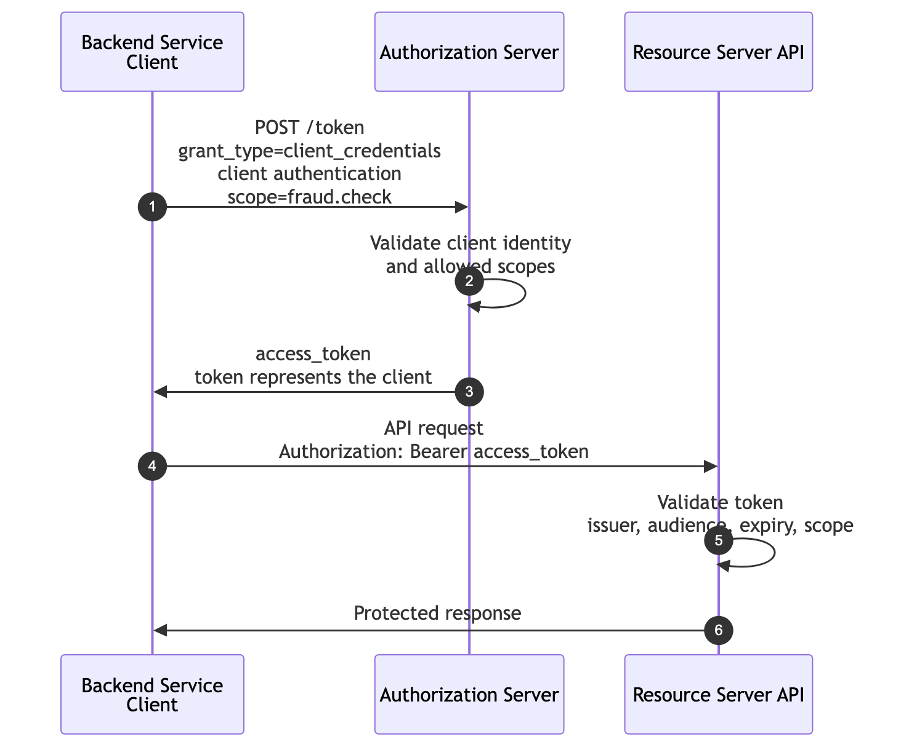
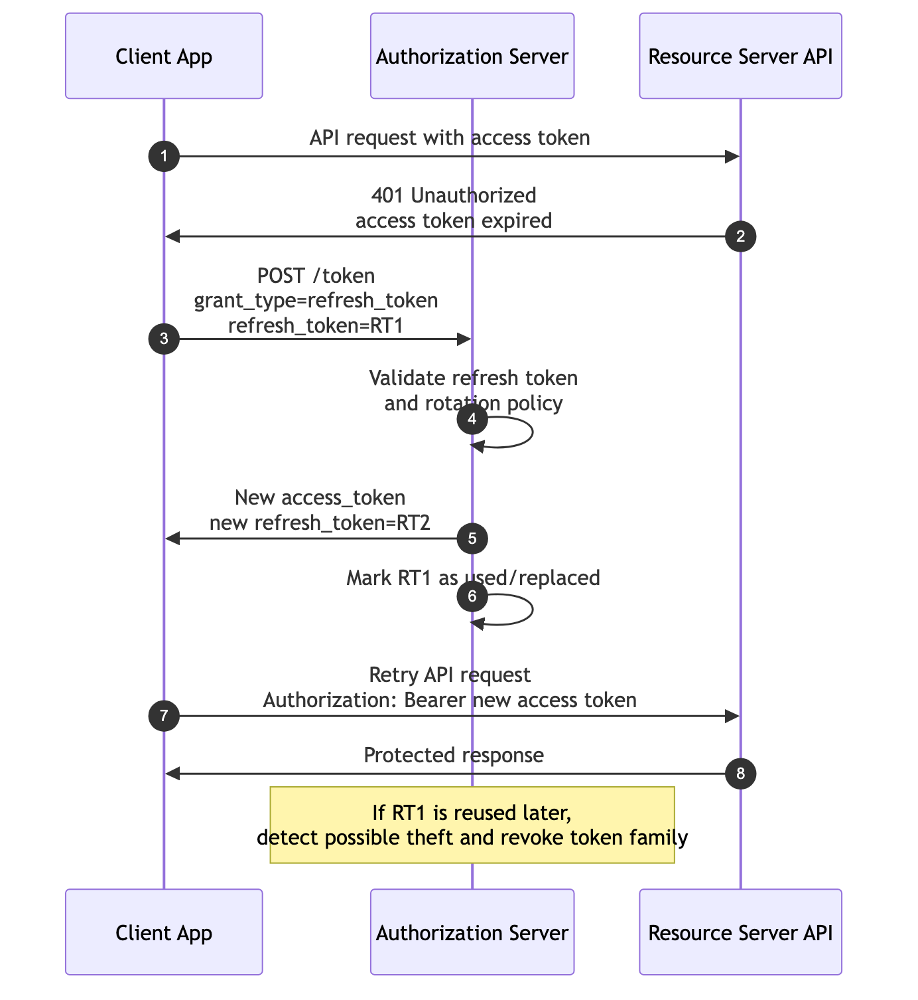
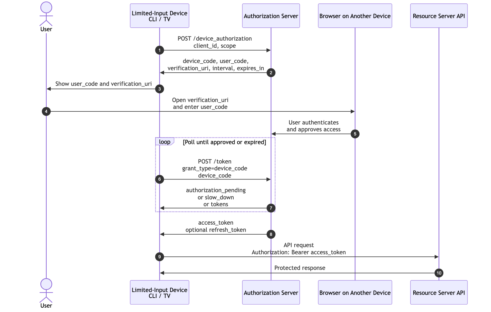

```{=latex}
\makelessoncover{3}{OAuth 2.0: Client Credentials, Refresh Token, and Device Authorization Flows}
```

# Learning Goal

This lesson covers three OAuth flows that solve different practical problems:

- **Client Credentials Flow**: machine-to-machine access with no user.
- **Refresh Token Flow**: getting new access tokens without asking the user to repeat the full authorization flow.
- **Device Authorization Flow**: login or authorization for devices that cannot easily use a browser or keyboard.

After this lesson, you should be able to:

- Explain why Client Credentials is not user login.
- Compare Authorization Code Flow and Client Credentials Flow.
- Explain how a backend service can call another backend service.
- Explain what happens if a client secret leaks.
- Draw a refresh token rotation timeline.
- Design basic token storage rules for web apps, mobile apps, SPAs, and backend services.
- Explain why refresh tokens are more sensitive than access tokens.
- Explain when Device Authorization Flow is better than normal redirects.
- Explain polling, `authorization_pending`, and `slow_down`.

# 1. Flow Selection Overview

| Problem | Best-Fit Flow |
|---|---|
| A backend service needs to call another backend service without a user. | Client Credentials Flow |
| A client already has user authorization and needs a new access token. | Refresh Token Flow |
| A CLI, TV, printer, or limited-input device needs user authorization. | Device Authorization Flow |

The key teaching point:

> OAuth is not one flow. OAuth is a framework with different flows for different trust situations.

# 2. Client Credentials Flow

Client Credentials Flow is used for machine-to-machine access.

There is no user. There is no consent screen. There is no browser redirect.

The client authenticates directly to the token endpoint and receives an access token that represents the client itself.

Use this flow when:

- A backend service calls another backend API.
- A scheduled job calls an internal API.
- A CI pipeline calls a package registry.
- A fraud service, pricing service, or inventory service needs service-level access.

Do not use this flow for user login.

## What To Observe

| Question | Answer |
|---|---|
| Is there a browser redirect? | No. |
| Is there a user? | No human resource owner participates directly. |
| How does the client authenticate? | Usually with a client secret, private key JWT, mTLS, or another confidential-client method. |
| What scopes should be granted? | Only the machine permissions the service needs. |

# 3. Client Credentials Sequence Diagram

{width=100%}

# 4. Client Credentials Request Example

```http
POST /token
Content-Type: application/x-www-form-urlencoded
Authorization: Basic base64(client_id:client_secret)

grant_type=client_credentials&
scope=fraud.check
```

Example response:

```json
{
  "access_token": "eyJ...",
  "token_type": "Bearer",
  "expires_in": 900,
  "scope": "fraud.check"
}
```

Important:

> The access token represents the client, not a user.

# 5. Comparison: Auth Code vs Client Credentials

| Topic | Authorization Code Flow | Client Credentials Flow |
|---|---|---|
| Main purpose | User-delegated API access. | Machine-to-machine API access. |
| User involved? | Yes. | No. |
| Browser redirect? | Yes. | No. |
| Consent screen? | Often yes. | No user consent screen. |
| Token represents | The client acting with user-delegated permission. | The client/service itself. |
| Example | Deployment dashboard accesses a user's GitHub repositories. | Inventory service calls pricing service. |

Simple sentence:

> Authorization Code Flow is for user-delegated access. Client Credentials Flow is for service access.

# 6. Example: Backend Service Calling Fraud Service

Scenario:

> An order service needs to call a fraud detection service before approving a purchase.

Actor mapping:

| OAuth Actor | In This Scenario |
|---|---|
| Client | Order service |
| Authorization Server | Internal identity/token server |
| Resource Server | Fraud detection API |
| Resource Owner | Usually the organization/system, not a human user |

Flow:

1. Order service authenticates to the token endpoint.
2. Authorization server validates the order service.
3. Authorization server issues an access token with `fraud.check` scope.
4. Order service calls the fraud API with the token.
5. Fraud API validates the token and returns a risk result.

Example API call:

```http
POST /fraud/check
Authorization: Bearer access_token
Content-Type: application/json

{
  "order_id": "ord_123",
  "amount": 250000,
  "currency": "IDR"
}
```

# 7. Risk: What Goes Wrong If the Client Secret Leaks?

If a client secret leaks, an attacker may impersonate the client.

Possible impact:

- The attacker can request access tokens as that client.
- The attacker can call APIs using the client's permissions.
- Logs may show the real client ID, making abuse harder to separate from legitimate traffic.
- If scopes are broad, the attacker gets broad machine access.
- The organization may need to rotate secrets and revoke active tokens.

Mitigations:

- Store secrets only in secure server-side environments.
- Never put client secrets in browser code, mobile apps, or public repositories.
- Use short-lived access tokens.
- Use least-privilege scopes.
- Rotate secrets.
- Monitor unusual token issuance and API usage.
- Prefer stronger client authentication such as private key JWT or mTLS for high-risk systems.

# 8. Refresh Token Flow

Access tokens should usually be short-lived.

If an access token expires, the client can use a refresh token to obtain a new access token without sending the user through the full authorization flow again.

The refresh token is more sensitive than the access token because it can be used to get more access tokens.

Use refresh tokens when:

- The user should stay signed in.
- The app needs long-running access.
- Access tokens are intentionally short-lived.

Do not treat refresh tokens like normal API tokens. They need stronger storage and lifecycle rules.

## What To Observe

| Question | Why It Matters |
|---|---|
| Where is the refresh token stored? | Storage quality determines theft risk. |
| How long does it live? | Long-lived refresh tokens increase impact if stolen. |
| Can public clients safely store it? | Public clients have weaker storage than backend servers. |
| What happens when reuse is detected? | Reuse can indicate token theft. |

# 9. Refresh Token Sequence Diagram

{width=100%}

# 10. Refresh Token Request Example

```http
POST /token
Content-Type: application/x-www-form-urlencoded

grant_type=refresh_token&
refresh_token=REFRESH_TOKEN
```

Example response with rotation:

```json
{
  "access_token": "new_access_token",
  "token_type": "Bearer",
  "expires_in": 900,
  "refresh_token": "new_refresh_token"
}
```

In rotation, the old refresh token is replaced by a new refresh token.

# 11. Refresh Token Rotation Timeline

Example timeline:

| Time | Event |
|---|---|
| T0 | Client receives access token `AT1` and refresh token `RT1`. |
| T1 | `AT1` expires. |
| T2 | Client sends `RT1` to the token endpoint. |
| T3 | Authorization server returns `AT2` and `RT2`. |
| T4 | Authorization server marks `RT1` as used or replaced. |
| T5 | Client stores `RT2` and deletes `RT1`. |
| T6 | If `RT1` appears again, the server treats it as possible theft. |
| T7 | Server may revoke `RT2` and the whole refresh token family. |

The important idea:

> Rotation makes refresh token reuse suspicious.

# 12. Storage Rules by Client Type

| Client Type | Suggested Storage Rule |
|---|---|
| Server-side web app | Store refresh tokens server-side only, ideally encrypted at rest. Use secure, HTTP-only cookies only for session identifiers, not raw refresh tokens when possible. |
| Mobile app | Use platform secure storage such as Keychain or Keystore. Avoid logs and plain local storage. Use rotation. |
| SPA | Avoid long-lived refresh tokens when possible. If used, rely on authorization server protections such as rotation, reuse detection, and browser-aware storage strategy. |
| Backend service | Usually does not use refresh tokens for Client Credentials. It requests new access tokens with client authentication instead. |

Practical warning:

> A refresh token stored in a weak location becomes a long-lived credential for the attacker.

# 13. Why Refresh Tokens Are More Sensitive Than Access Tokens

Access tokens are used to call APIs. They should usually be short-lived.

Refresh tokens are used to get new access tokens. They often live longer.

That means a stolen access token may be useful for minutes, while a stolen refresh token may let an attacker keep getting new access tokens until the refresh token expires, is revoked, or reuse is detected.

Simple sentence:

> An access token opens the door once. A refresh token may keep making new keys.

# 14. Device Authorization Flow

Device Authorization Flow is used when the client has limited input or cannot easily use a browser.

Common examples:

- CLI tools
- Smart TVs
- Printers
- Game consoles
- IoT or appliance-like devices

The device shows a `user_code` and `verification_uri`. The user opens the URI on another device, such as a phone or laptop, enters the code, authenticates, and approves access.

Meanwhile, the original device polls the token endpoint until authorization is complete.

## What To Observe

| Question | Answer |
|---|---|
| Who enters the user code? | The user enters it on another device with a browser. |
| How does polling work? | The device repeatedly calls the token endpoint using `device_code`. |
| What does `slow_down` mean? | The client is polling too frequently and must increase the polling interval. |
| Why is this good for CLI/TV devices? | The user can authenticate on a normal browser instead of typing passwords on a limited device. |

# 15. Device Authorization Sequence Diagram

{width=100%}

# 16. Device Authorization Request Example

The device starts by requesting a device code:

```http
POST /device_authorization
Content-Type: application/x-www-form-urlencoded

client_id=tv-app&
scope=profile.read
```

Example response:

```json
{
  "device_code": "device_secret_code",
  "user_code": "ABCD-EFGH",
  "verification_uri": "https://auth.example.com/device",
  "verification_uri_complete": "https://auth.example.com/device?user_code=ABCD-EFGH",
  "expires_in": 600,
  "interval": 5
}
```

The device shows:

```text
Go to https://auth.example.com/device
Enter code: ABCD-EFGH
```

# 17. Polling the Token Endpoint

While the user completes the browser step, the device polls:

```http
POST /token
Content-Type: application/x-www-form-urlencoded

grant_type=urn:ietf:params:oauth:grant-type:device_code&
device_code=device_secret_code&
client_id=tv-app
```

Possible responses:

| Response | Meaning |
|---|---|
| `authorization_pending` | The user has not finished yet. Keep polling. |
| `slow_down` | The device is polling too fast. Increase the interval. |
| `expired_token` | The device code expired. Restart the flow. |
| `access_denied` | The user denied the request. Stop the flow. |
| Access token response | The user approved. Use the access token. |

# 18. Example: CLI Login

Scenario:

> A CLI tool needs access to a user's cloud account.

Flow:

1. User runs `cloudctl login`.
2. CLI requests a `device_code` and `user_code`.
3. CLI prints:

```text
Open https://auth.example.com/device
Enter code: WXYZ-1234
```

4. User opens the URL in a browser.
5. User logs in and approves CLI access.
6. CLI polls the token endpoint.
7. Authorization server returns access token.
8. CLI stores the token according to its security policy.
9. CLI can now call the cloud API.

# 19. Comparison: Device Flow vs Auth Code Flow

| Topic | Authorization Code Flow | Device Authorization Flow |
|---|---|---|
| Best for | Apps that can receive browser redirects. | Devices or CLIs with limited browser/input capability. |
| User interaction | User is redirected in the same browser/app flow. | User uses another browser-capable device. |
| Main temporary value | Authorization code. | Device code and user code. |
| Token request | Client exchanges authorization code. | Device polls token endpoint using device code. |
| Common examples | Web app, mobile app, SPA with PKCE. | CLI, TV app, printer, console. |

Simple sentence:

> Auth Code Flow brings the browser to the app. Device Flow sends the user to a browser somewhere else.

# 20. Common Mistakes

| Mistake | Why It Is Bad |
|---|---|
| Using Client Credentials for user login | The token represents the client, not the user. |
| Giving machine clients broad scopes | A leaked secret becomes much more damaging. |
| Storing refresh tokens in logs or local plain text | Refresh tokens can mint new access tokens. |
| Not rotating refresh tokens | Theft may be harder to detect. |
| Polling device flow too quickly | The server may return `slow_down`; aggressive polling wastes resources. |
| Asking users to enter passwords on a TV or CLI | Device Flow exists to avoid poor login UX and unsafe password handling. |

# 21. Discussion Questions

1. Why is Client Credentials not user login?
2. What should an access token represent in Client Credentials Flow?
3. Why are refresh tokens more dangerous than short-lived access tokens?
4. What should happen if an old refresh token is reused after rotation?
5. Why does Device Flow use both `device_code` and `user_code`?
6. Why does `slow_down` exist?

# 22. Definition of Done

You are ready to move on when you can:

- Explain when to use Client Credentials Flow.
- Clearly say that Client Credentials is not user login.
- Explain the backend service calling fraud service example.
- Explain what happens when a client secret leaks.
- Draw a refresh token rotation timeline.
- Design basic token storage rules for web app, mobile app, SPA, and backend service.
- Explain why refresh tokens are more sensitive than access tokens.
- Explain Device Authorization Flow for CLI or TV login.
- Explain polling, `authorization_pending`, `slow_down`, and `expired_token`.

# Appendix: Slide Outline

This paper can become a short teaching presentation with this slide flow:

1. Three practical OAuth flows
2. Client Credentials: no user, no browser
3. Client Credentials sequence diagram
4. Backend service calling fraud service
5. What if client secret leaks?
6. Refresh tokens: why access tokens should be short-lived
7. Refresh token rotation timeline
8. Storage rules by client type
9. Device Authorization Flow
10. CLI login example
11. Device Flow vs Auth Code Flow
12. Recap and discussion questions
