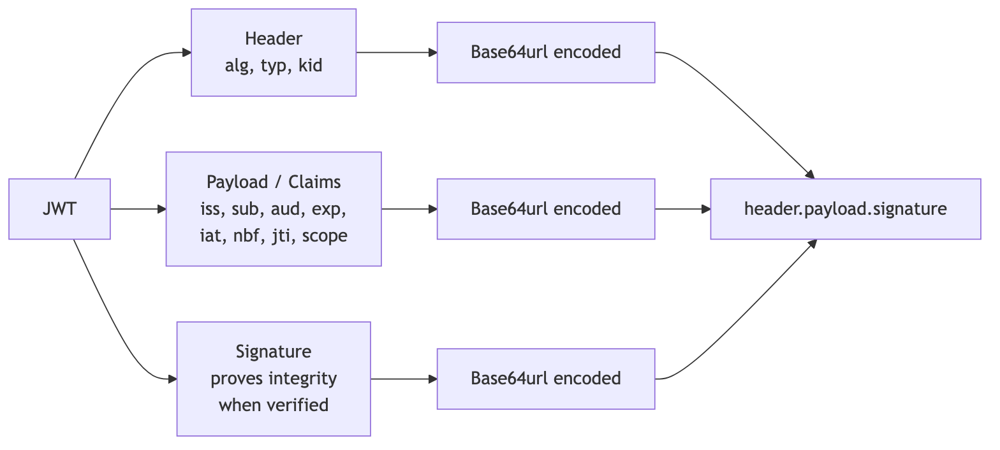
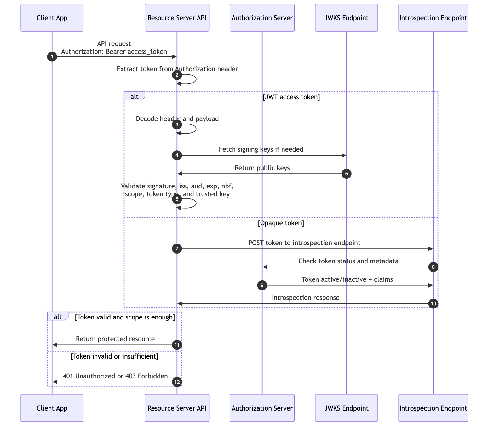

```{=latex}
\makelessoncover{4}{OAuth 2.0: Token Validation and JWT Basics}
```

# Learning Goal

This lesson combines two closely related topics:

- **JWT Basics**: what a JWT is, what claims it contains, and what it does not prove by itself.
- **Token Validation**: how a resource server decides whether to accept or reject a token.

After this lesson, you should be able to:

- Explain what a JWT is.
- Identify common JWT claims such as `iss`, `sub`, `aud`, `exp`, `iat`, `nbf`, `jti`, and `scope`.
- Explain why decoding a JWT is not validation.
- Explain the difference between JWT access tokens and opaque access tokens.
- Validate issuer, audience, expiry, signature, scope, and signing key.
- Explain when introspection is needed.
- Reject invalid tokens for the right reason.
- Explain why JWT does not automatically mean secure.

# 1. Why Token Validation Matters

OAuth is not finished when a client receives an access token.

The resource server must decide whether to accept the token before returning protected data.

Example:

```http
GET /repos
Authorization: Bearer access_token
```

The API should not simply trust that the token exists. It must validate whether the token is legitimate, current, intended for this API, and powerful enough for the requested action.

Core rule:

> A resource server must validate tokens before accepting API calls.

# 2. JWT Basics

JWT stands for **JSON Web Token**.

A JWT is a compact claims format. It is often used to carry information such as issuer, subject, audience, expiry, and scopes.

A common JWT has three parts:

```text
header.payload.signature
```

Each part is base64url encoded.

Important:

> A JWT is a format. It is not automatically secure.

Security depends on validation and context.

# 3. JWT Structure Diagram

{width=95%}

# 4. Example JWT Payload

Example decoded payload:

```json
{
  "iss": "https://auth.example.com",
  "sub": "user_123",
  "aud": "https://api.example.com",
  "exp": 1760000000,
  "iat": 1759996400,
  "nbf": 1759996400,
  "jti": "token-id-789",
  "scope": "repo.read repo.write"
}
```

Line-by-line explanation:

| Claim | Meaning |
|---|---|
| `iss` | Issuer. The authorization server that issued the token. |
| `sub` | Subject. The user, service, or entity the token is about. |
| `aud` | Audience. The API or resource server that should consume the token. |
| `exp` | Expiration time. The token must not be accepted after this time. |
| `iat` | Issued-at time. When the token was issued. |
| `nbf` | Not-before time. The token must not be accepted before this time. |
| `jti` | JWT ID. A unique token identifier, useful for tracking or replay protection patterns. |
| `scope` | Permissions granted to the token. |

# 5. JWT Claim Glossary

| Claim | Full Name | Validation Question |
|---|---|---|
| `iss` | Issuer | Do we trust this issuer? |
| `sub` | Subject | Who or what is this token about? |
| `aud` | Audience | Is this token meant for this API? |
| `exp` | Expiration Time | Is the token still valid? |
| `iat` | Issued At | Does the issue time make sense? |
| `nbf` | Not Before | Is the token being used too early? |
| `jti` | JWT ID | Can this token be uniquely identified? |
| `scope` | Scope | Does the token have enough permission? |
| `client_id` | Client Identifier | Which client received or is using the token? |
| `typ` | Token Type | Is this token the expected kind of token? |

# 6. Access Token or ID Token?

Do not treat every JWT the same way.

| Token | Main Purpose | Consumed By |
|---|---|---|
| Access token | Authorize API access. | Resource server / API. |
| ID token | Prove authentication information about the user. | Client application. |

Important distinction:

> APIs validate access tokens. Clients validate ID tokens.

If an API receives an ID token where it expects an access token, it should reject it.

# 7. Decoding Is Not Validation

JWTs are easy to decode because the header and payload are base64url encoded.

Anyone can decode this:

```text
header.payload.signature
```

Decoding only answers:

> What text is inside the token?

Validation answers:

> Should this API trust this token for this request?

That requires checking the signature, issuer, audience, expiry, scope, token type, and signing key.

Simple rule:

> Decoding reads the token. Validation decides whether to trust it.

# 8. Token Validation Sequence Diagram

{width=100%}

# 9. JWT Access Token Validation Checklist

When a resource server receives a JWT access token, it should check:

1. **Token format**: Is the token structurally valid?
2. **Signature**: Was the token signed by a trusted key?
3. **Algorithm**: Is the signing algorithm expected and allowed?
4. **Key ID**: Does `kid` point to a trusted signing key?
5. **Issuer**: Does `iss` match a trusted authorization server?
6. **Audience**: Does `aud` match this API?
7. **Expiration**: Is `exp` still valid?
8. **Not before**: Is `nbf` valid for the current time?
9. **Scope or permissions**: Is `scope` enough for the requested operation?
10. **Token type**: Is this an access token, not an ID token?
11. **Revocation or risk state**: Does local policy require revocation checks or introspection?

# 10. Opaque Tokens and Introspection

Not every access token is a JWT.

Some access tokens are opaque strings. The API cannot validate their contents locally because the contents are not visible to the API.

Example opaque token:

```text
f9f9b7f4-9b6c-4e5f-ae61-token-value
```

For opaque tokens, the resource server may call the introspection endpoint.

The introspection endpoint answers questions like:

- Is this token active?
- Who issued it?
- Who is the subject?
- What audience is it for?
- What scopes does it have?
- When does it expire?

Example introspection response:

```json
{
  "active": true,
  "iss": "https://auth.example.com",
  "sub": "user_123",
  "aud": "https://api.example.com",
  "scope": "repo.read",
  "exp": 1760000000
}
```

# 11. Five Invalid JWT Examples

| Invalid Token Example | Why It Should Be Rejected |
|---|---|
| Token has `exp` in the past. | The token is expired. |
| Token has `aud` for another API. | The token was not meant for this resource server. |
| Token has unknown or untrusted `iss`. | The token came from an issuer this API does not trust. |
| Token signature does not verify. | The token may have been modified or signed by the wrong key. |
| Token has only `repo.read` but request needs `repo.write`. | The token does not have enough scope. |

Participant exercise:

> For each invalid token, identify whether the correct response should be `401 Unauthorized` or `403 Forbidden`.

General rule:

- Use `401 Unauthorized` when the token is missing, expired, malformed, or invalid.
- Use `403 Forbidden` when the token is valid but does not have enough permission.

# 12. What Should Not Be Put in a JWT?

Do not put sensitive secrets in a JWT payload.

Avoid storing:

- Passwords.
- Client secrets.
- API keys.
- Private keys.
- Credit card numbers.
- Sensitive personal data.
- Internal-only data that should not be visible to the token holder.

Reason:

> A signed JWT is not automatically encrypted.

Anyone who has the token can usually decode the header and payload.

If confidentiality is required, use an appropriate encryption approach such as JWE, or avoid putting the sensitive value in the token at all.

# 13. Common Mistakes

| Mistake | Why It Is Dangerous |
|---|---|
| Decoding a JWT and trusting it without verifying the signature. | Attackers may modify claims or use fake tokens. |
| Accepting any issuer. | Tokens from untrusted systems may be accepted. |
| Ignoring `aud`. | A token meant for one API may be reused against another API. |
| Ignoring `exp`. | Expired tokens may remain usable. |
| Trusting scopes without checking the requested action. | A token may be valid but insufficient. |
| Treating an ID token as an access token. | Login identity and API authorization become confused. |
| Accepting weak or unexpected algorithms. | Algorithm confusion or weak-signing risks may appear. |
| Putting secrets in JWT payloads. | Anyone holding the token may read the payload. |

# 14. Practical Validation Decision

When an API receives a token, ask these questions in order:

1. Is there a token?
2. Is the token structurally valid?
3. Can I verify it locally, or do I need introspection?
4. Do I trust the issuer?
5. Is this token meant for my API?
6. Is the token still valid in time?
7. Is the signing key trusted?
8. Is this the right token type?
9. Does the token have enough scope for this action?

If any answer fails, reject the request.

# 15. Discussion Questions

1. Why is decoding a JWT not enough?
2. What can go wrong if an API ignores `aud`?
3. Why should an API reject an ID token?
4. When would an API use introspection instead of local JWT validation?
5. Why should secrets not be placed in JWT payloads?
6. What is the difference between an expired token and a token with insufficient scope?

# 16. Definition of Done

You are ready to move on when you can:

- Explain a JWT payload without trusting it blindly.
- Identify issuer, subject, audience, and expiry claims.
- Explain why JWT is a format, not a security guarantee.
- Explain the difference between an access token and ID token.
- Explain why decoding is not validation.
- Use a validation checklist.
- Reject a token for the right reason.
- Explain when opaque token introspection is required.

# Appendix: Slide Outline

This paper can become a short teaching presentation with this slide flow:

1. Why token validation matters
2. JWT as a compact claims format
3. JWT structure: header, payload, signature
4. Common JWT claims
5. Access token vs ID token
6. Decoding is not validation
7. Token validation sequence diagram
8. JWT validation checklist
9. Opaque tokens and introspection
10. Invalid JWT examples
11. What not to put in JWTs
12. Recap and discussion questions

