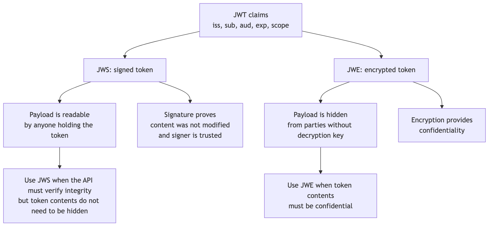
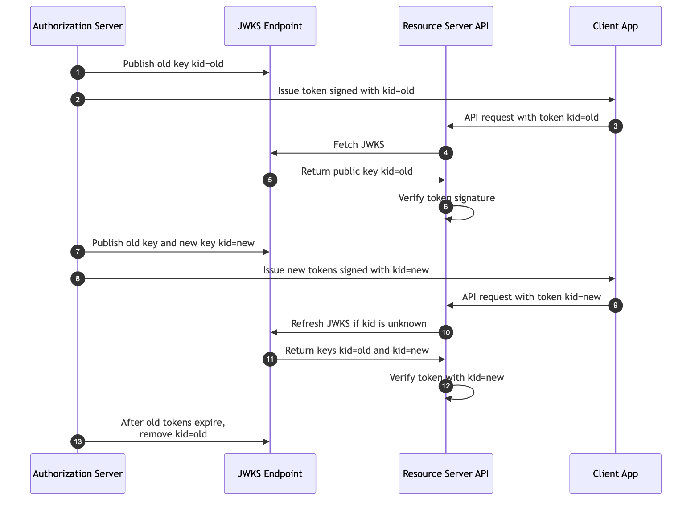

```{=latex}
\makelessoncover{5}{OAuth 2.0: JWS, JWE, and JWK/JWKS}
```

# Learning Goal

This lesson explains the JOSE building blocks that often appear around JWT-based OAuth systems:

- **JWS**: signing and integrity protection.
- **JWE**: encryption and confidentiality.
- **JWK**: a JSON representation of a cryptographic key.
- **JWKS**: a JSON document containing a set of keys.

After this lesson, you should be able to:

- Explain that JWS proves content was not modified.
- Explain that JWE hides content from parties without the decryption key.
- Explain that JWK/JWKS represent and publish keys.
- Explain how `kid` helps select a key.
- Explain where a verifier gets the public key.
- Trace a JWKS key rotation example.
- Identify common `alg` and `kid` mistakes.

# 1. Where This Fits

OAuth defines authorization flows and token usage patterns.

JWT defines a compact claims format.

JOSE is the family of standards that defines signing, encryption, and JSON-based keys.

The common pieces are:

| Term | Full Name | Main Purpose |
|---|---|---|
| JWT | JSON Web Token | Compact claims format. |
| JWS | JSON Web Signature | Integrity and signature protection. |
| JWE | JSON Web Encryption | Confidentiality through encryption. |
| JWK | JSON Web Key | JSON representation of a cryptographic key. |
| JWKS | JSON Web Key Set | JSON document containing multiple JWKs. |

Simple mental model:

> JWT is the container. JWS signs it. JWE encrypts it. JWK/JWKS publish the keys used to verify or encrypt it.

# 2. JWS: Signed Content

JWS provides integrity and signature protection.

It helps answer:

> Was this token modified, and was it signed by a key I trust?

A signed JWT is commonly represented as:

```text
header.payload.signature
```

The header and payload are readable by anyone who has the token. The signature protects the content from undetected modification.

Important:

> JWS does not hide the payload. It proves integrity when the signature is verified.

Example JWS header:

```json
{
  "alg": "RS256",
  "typ": "JWT",
  "kid": "key-2026-05"
}
```

Meaning:

| Field | Meaning |
|---|---|
| `alg` | Signing algorithm used for the token. |
| `typ` | Token type, commonly `JWT`. |
| `kid` | Key ID used to select the verification key. |

# 3. JWE: Encrypted Content

JWE provides confidentiality.

It helps answer:

> Can parties without the decryption key read the token contents?

With JWE, the token contents are encrypted. A party holding the token cannot read the payload unless it has the correct decryption key.

Important:

> JWE hides content. JWS proves content was not modified.

JWE compact serialization usually has five parts:

```text
protected_header.encrypted_key.iv.ciphertext.tag
```

You do not need to memorize each part at the beginner stage. The important idea is that JWE is for encryption and confidentiality.

# 4. JWS vs JWE Diagram

{width=95%}

# 5. Signed vs Encrypted Analogy

Imagine sending a physical document.

**JWS is like signing the document.**

People can read it, but if someone changes the content, the signature check fails.

**JWE is like putting the document inside a locked box.**

People who do not have the key cannot read the content.

So:

| Question | JWS | JWE |
|---|---|---|
| Can others read the content? | Yes, usually. | No, not without the decryption key. |
| Can others modify it undetected? | No, if signature validation is done correctly. | No, encryption includes integrity protection in modern modes. |
| Main value | Integrity and authenticity. | Confidentiality. |
| Common OAuth use | Signed JWT access tokens. | Encrypted tokens or sensitive payloads. |

# 6. JWS Does Not Mean Private

A common mistake is thinking:

> This JWT is signed, so the payload must be private.

That is wrong.

A signed JWT payload can usually be decoded by anyone who has the token.

Example:

```text
header.payload.signature
```

The payload is only base64url encoded, not encrypted.

Do not put secrets in a signed JWT payload unless you are comfortable with the token holder reading them.

# 7. JWE Does Not Replace Authorization

JWE hides content, but encryption alone does not answer every authorization question.

An API still needs to check:

- Who issued the token?
- Is the audience correct?
- Has the token expired?
- Is the token allowed for this action?
- Is the decryption key trusted?
- Does local policy allow this token?

Encryption protects confidentiality. It does not replace token validation.

# 8. JWK: JSON Web Key

A JWK is a JSON representation of a cryptographic key.

For example, an authorization server may publish a public key so APIs can verify signed JWTs.

Example RSA public JWK:

```json
{
  "kty": "RSA",
  "kid": "key-2026-05",
  "use": "sig",
  "alg": "RS256",
  "n": "base64url-modulus",
  "e": "AQAB"
}
```

Important fields:

| Field | Meaning |
|---|---|
| `kty` | Key type, such as `RSA`, `EC`, or `oct`. |
| `kid` | Key ID. Helps select which key to use. |
| `use` | Intended key use, such as `sig` for signature. |
| `alg` | Intended algorithm, such as `RS256`. |
| `n`, `e` | RSA public key parameters. |

# 9. JWKS: JSON Web Key Set

JWKS is a JSON document containing multiple JWKs.

Example:

```json
{
  "keys": [
    {
      "kty": "RSA",
      "kid": "key-2026-05",
      "use": "sig",
      "alg": "RS256",
      "n": "base64url-modulus",
      "e": "AQAB"
    },
    {
      "kty": "RSA",
      "kid": "key-2026-06",
      "use": "sig",
      "alg": "RS256",
      "n": "base64url-modulus",
      "e": "AQAB"
    }
  ]
}
```

The resource server uses JWKS to find public keys for signature verification.

The JWKS endpoint is often discovered from authorization server metadata.

Example:

```text
https://auth.example.com/.well-known/oauth-authorization-server
```

or, for OpenID Connect providers:

```text
https://auth.example.com/.well-known/openid-configuration
```

Those metadata documents can point to:

```text
jwks_uri: https://auth.example.com/.well-known/jwks.json
```

# 10. What `kid` Selects

`kid` means key ID.

When a JWT header says:

```json
{
  "alg": "RS256",
  "kid": "key-2026-05"
}
```

The verifier looks inside the JWKS for a key with:

```text
kid = key-2026-05
```

Then it uses that key to verify the signature.

Important:

> `kid` helps select a key. It does not prove the key is trusted by itself.

The verifier must only use keys from trusted sources.

# 11. Where the Verifier Gets the Public Key

For asymmetric signing such as `RS256`:

1. Authorization server signs token with its private key.
2. Authorization server publishes the matching public key in JWKS.
3. Resource server fetches JWKS from a trusted `jwks_uri`.
4. Resource server selects the key by `kid`.
5. Resource server verifies the token signature.

The private key must stay private. The public key can be published.

For symmetric signing such as `HS256`, the same secret is used to sign and verify. That secret must not be published in JWKS for public consumption.

# 12. JWKS Key Rotation

Authorization servers rotate keys so old keys can be retired and new keys can be introduced safely.

Good rotation usually has overlap:

1. Publish old key.
2. Start publishing new key while old tokens may still exist.
3. Sign new tokens with new key.
4. Keep old key available until old tokens expire.
5. Remove old key after it is no longer needed.

# 13. JWKS Key Rotation Diagram

{width=100%}

# 14. Key Rotation Timeline

| Time | Event |
|---|---|
| T0 | JWKS contains `kid=old`. Existing tokens are signed with old key. |
| T1 | Authorization server publishes both `kid=old` and `kid=new`. |
| T2 | New tokens start using `kid=new`. |
| T3 | Resource servers refresh JWKS when they see unknown `kid=new`. |
| T4 | Old tokens signed with `kid=old` continue working until they expire. |
| T5 | After old tokens expire, authorization server removes `kid=old` from JWKS. |

Important:

> Do not remove the old key before old tokens have expired, or valid tokens may suddenly fail.

# 15. Common `alg` Mistakes

The `alg` header tells the verifier what algorithm the token says it uses.

The verifier must not blindly trust it.

Common mistakes:

| Mistake | Why It Is Dangerous |
|---|---|
| Accepting `alg=none`. | An attacker may send an unsigned token. |
| Accepting any algorithm. | The API may accept weaker or unexpected algorithms. |
| Confusing symmetric and asymmetric algorithms. | An implementation may misuse a public key as an HMAC secret. |
| Trusting token header policy instead of server configuration. | The attacker controls the header in an untrusted token. |

Safe rule:

> The verifier should enforce allowed algorithms from configuration, not from whatever the token asks for.

# 16. Common `kid` Mistakes

Common mistakes:

| Mistake | Why It Is Dangerous |
|---|---|
| Fetching keys from a URL controlled by the token. | Attacker may point the verifier to attacker-controlled keys. |
| Using `kid` directly in file paths or database queries without care. | Can create injection or path traversal risks. |
| Accepting duplicate `kid` values without clear behavior. | Verifier may select the wrong key. |
| Failing to refresh JWKS when a new `kid` appears. | Valid tokens may fail during rotation. |
| Never expiring JWKS cache. | Revoked or retired keys may remain trusted too long. |

Safe rule:

> `kid` selects among trusted keys. It must not decide where trust comes from.

# 17. Verification Questions

When verifying a JWS-signed JWT, ask:

1. Do I trust the issuer?
2. Did I get JWKS from a trusted metadata or configuration source?
3. Is `alg` allowed for this issuer?
4. Does `kid` match exactly one trusted key?
5. Does the signature verify?
6. Is `aud` this API?
7. Is `exp` still valid?
8. Is the scope enough?

# 18. Mini Quiz

| Scenario | What Is Wrong? |
|---|---|
| A signed JWT contains a password in the payload. | JWS does not hide payload contents. |
| An API accepts tokens with `alg=none`. | The API may accept unsigned tokens. |
| A verifier fetches JWKS from a URL inside the token header. | The token may control the trust source. |
| New tokens use `kid=new`, but APIs only cached `kid=old`. | JWKS refresh or rotation handling is missing. |
| An API accepts a token signed by an unknown issuer. | Issuer trust validation is missing. |

# 19. Standards Reference

These standards are part of the JOSE family:

- **[RFC 7515: JSON Web Signature (JWS)](https://www.rfc-editor.org/rfc/rfc7515)**  
  Defines signing and integrity protection.

- **[RFC 7516: JSON Web Encryption (JWE)](https://www.rfc-editor.org/rfc/rfc7516)**  
  Defines encrypted JWT/content structures.

- **[RFC 7517: JSON Web Key (JWK)](https://www.rfc-editor.org/rfc/rfc7517)**  
  Defines JSON-based key representation and key sets.

- **[RFC 7518: JSON Web Algorithms (JWA)](https://www.rfc-editor.org/rfc/rfc7518)**  
  Defines algorithms used by JWS, JWE, and JWK.

- **[RFC 7519: JSON Web Token (JWT)](https://www.rfc-editor.org/rfc/rfc7519)**  
  Defines JWT as a compact claims format.

# 20. Discussion Questions

1. If a token is signed, can everyone still read the payload?
2. If a token is encrypted, does the API still need to validate issuer and audience?
3. What does `kid` select?
4. Where should a verifier get public keys?
5. Why should old keys remain in JWKS until old tokens expire?
6. Why should allowed algorithms come from configuration?

# 21. Definition of Done

You are ready to move on when you can:

- Explain JWS as integrity/signature protection.
- Explain JWE as confidentiality/encryption.
- Explain JWK as a JSON key format.
- Explain JWKS as a published key set.
- Explain how `kid` selects a key.
- Trace JWKS key rotation.
- Explain why signed does not mean private.
- Identify common `alg` and `kid` mistakes.

# Appendix: Slide Outline

This paper can become a short teaching presentation with this slide flow:

1. JOSE overview: JWT, JWS, JWE, JWK, JWKS
2. JWS: signed and readable
3. JWE: encrypted and confidential
4. Signed vs encrypted analogy
5. JWK and JWKS
6. What `kid` selects
7. Where the verifier gets public keys
8. JWKS key rotation
9. `alg` mistakes
10. `kid` mistakes
11. Mini quiz
12. Recap and readiness check

