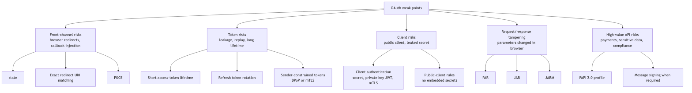

```{=latex}
\makelessoncover{6}{OAuth 2.0: Security Controls}
```

# Learning Goal

This module closes the core OAuth section by focusing on common mistakes and the controls that reduce them.

After this lesson, you should be able to:

- Explain why Implicit Flow and Resource Owner Password Credentials are avoided.
- Identify weak points around redirects, tokens, clients, and replay.
- Explain `state`, exact redirect URI matching, PKCE, short token lifetime, refresh token rotation, and sender-constrained tokens.
- Threat-model Authorization Code Flow.
- Match common OAuth attacks to mitigations.
- Explain which control is missing in a scenario.

# 1. Deprecated and Legacy Flows

Two older OAuth flows are important historical context:

- **Implicit Flow**
- **Resource Owner Password Credentials**, often called password grant

They are generally avoided in modern OAuth designs.

Modern replacement:

> Use Authorization Code Flow with PKCE for browser, mobile, SPA, and many user-based clients.

# 2. Why Implicit Flow Was Used Before

Implicit Flow was created for browser-based apps when browsers and JavaScript apps had fewer safe options for doing Authorization Code Flow.

In Implicit Flow, tokens could be returned directly through the browser redirect.

That was convenient, but risky.

Problem:

> Exposing access tokens in browser redirects increases the chance of token leakage.

Tokens in the browser front-channel may leak through browser history, referrer headers, logs, malicious scripts, browser extensions, screenshots, and redirect handling mistakes.

# 3. Why Password Credentials Flow Is Avoided

Resource Owner Password Credentials asks the client to collect the user's username and password.

That breaks the main OAuth mental model:

> OAuth exists so clients do not need the user's password.

Problems:

- The client sees the user's password.
- The user cannot easily limit permission.
- The user cannot distinguish the real service from a fake password prompt.
- Multi-factor authentication and modern login policies become harder.
- A compromised client compromises the user's real account credentials.

# 4. Old SPA Implicit vs Modern SPA Auth Code + PKCE

| Topic | Old SPA Implicit Flow | Modern SPA Auth Code + PKCE |
|---|---|---|
| Token delivery | Token returned through browser redirect. | Authorization code returned through browser; token comes from token endpoint. |
| PKCE protection | Not part of the original flow. | Code exchange is protected by `code_verifier`. |
| Token exposure | Higher risk because token is front-channel. | Lower risk because access token is not returned directly in redirect. |
| Recommended today? | Avoid. | Recommended with modern browser security guidance. |

One-slide warning:

> Avoid Implicit Flow and Password Credentials. Use Authorization Code + PKCE for user-based clients and Client Credentials for service-to-service access.

# 5. OAuth Security Controls Map

{width=100%}

# 6. Common Controls and What They Protect

| Control | Protects Against |
|---|---|
| `state` | Callback injection and CSRF-style confusion at the client. |
| Exact redirect URI matching | Authorization codes being sent to attacker-controlled callback URLs. |
| PKCE | Authorization code interception. |
| Short access-token lifetime | Long usefulness of stolen access tokens. |
| Refresh token rotation | Long-term refresh token theft and reuse. |
| Sender-constrained tokens | Bearer token replay. |
| Client authentication | Unauthorized clients obtaining tokens. |
| Strict scope design | Over-permissioned clients and tokens. |
| Token validation | APIs accepting invalid, expired, wrong-audience, or untrusted tokens. |

# 7. Threat Model: Authorization Code Flow

| Attack or Mistake | Impact | Mitigation |
|---|---|---|
| Missing `state` | Client may accept an authorization response it did not start. | Generate, store, and verify `state`. |
| Weak redirect URI matching | Code may be sent to attacker-controlled redirect URI. | Require exact registered redirect URI matching. |
| Authorization code interception | Attacker may try to exchange the code. | Use PKCE and short-lived single-use codes. |
| Client secret in SPA/mobile app | Secret can be extracted. | Treat SPA/mobile as public clients; use PKCE. |
| Long-lived access token | Stolen token remains useful for too long. | Use short access-token lifetime. |
| Refresh token theft | Attacker may keep minting access tokens. | Use secure storage, rotation, and reuse detection. |
| Bearer token replay | Anyone holding token can use it. | Use sender-constrained tokens such as DPoP or mTLS. |
| Missing audience validation | Token for one API may be accepted by another. | Validate `aud`. |

# 8. Scenario Quiz: What Control Is Missing?

| Scenario | Missing or Weak Control |
|---|---|
| The app accepts callback responses without checking `state`. | `state` validation. |
| The authorization server allows wildcard redirect URIs. | Exact redirect URI matching. |
| A mobile app uses Auth Code Flow but does not use PKCE. | PKCE. |
| An API accepts expired tokens. | Expiration validation. |
| A stolen bearer token works from another machine. | Sender-constrained token. |
| A refresh token can be reused many times without detection. | Refresh token rotation and reuse detection. |

# 9. Security Review Checklist

Use this checklist when reviewing an OAuth design:

1. Is the client public or confidential?
2. Can the client safely keep a secret?
3. Are redirect URIs exact and pre-registered?
4. Is `state` used and verified?
5. Is PKCE used where appropriate?
6. Are access tokens short-lived?
7. Are refresh tokens rotated with reuse detection?
8. Are tokens validated for issuer, audience, expiry, signature, scope, and key?
9. Can bearer tokens be replayed?
10. Are sender-constrained tokens needed?

# 10. Discussion Questions

1. Why is exposing tokens in browser redirects risky?
2. Why should clients not collect user passwords?
3. What does `state` protect?
4. What does exact redirect URI matching protect?
5. Why is PKCE useful even when `state` exists?
6. Why are short-lived access tokens not enough if refresh tokens are stored badly?

# 11. Standards Reference

- **[RFC 9700: OAuth 2.0 Security Best Current Practice](https://www.rfc-editor.org/rfc/rfc9700)**  
  Current best-practice security guidance for OAuth 2.0. It updates the older OAuth security advice and deprecates less secure modes of operation.

- **[RFC 7636: Proof Key for Code Exchange](https://www.rfc-editor.org/rfc/rfc7636)**  
  Defines PKCE, the control that protects authorization-code exchange for public clients.

- **[RFC 8252: OAuth 2.0 for Native Apps](https://www.rfc-editor.org/rfc/rfc8252)**  
  Important guidance for mobile and native-app redirect handling.

- **[RFC 6749: OAuth 2.0 Authorization Framework](https://www.rfc-editor.org/rfc/rfc6749)**  
  The original OAuth 2.0 framework.

# 12. Definition of Done

You are ready to move on when you can:

- Explain deprecated flows without recommending them.
- Explain why Authorization Code + PKCE replaced Implicit Flow for many clients.
- Identify OAuth attacks and match them to mitigations.
- Explain common security controls in practical terms.
- Review an OAuth flow and point out missing controls.

# Appendix: Slide Outline

1. Legacy flows to avoid
2. Why Implicit Flow is risky
3. Why password grant is risky
4. Security controls map
5. Auth Code threat model
6. Attack/mitigation table
7. Scenario quiz
8. Security review checklist
