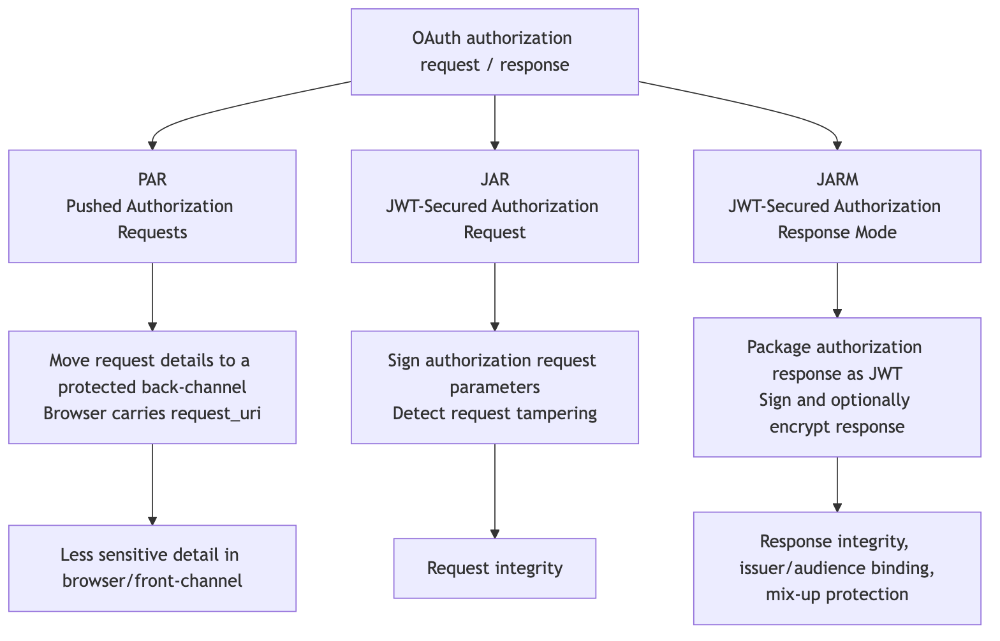
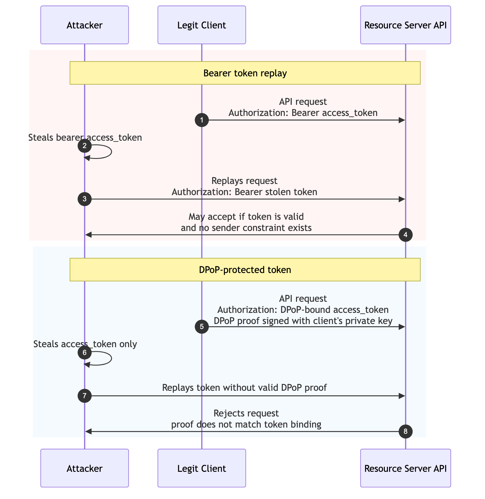
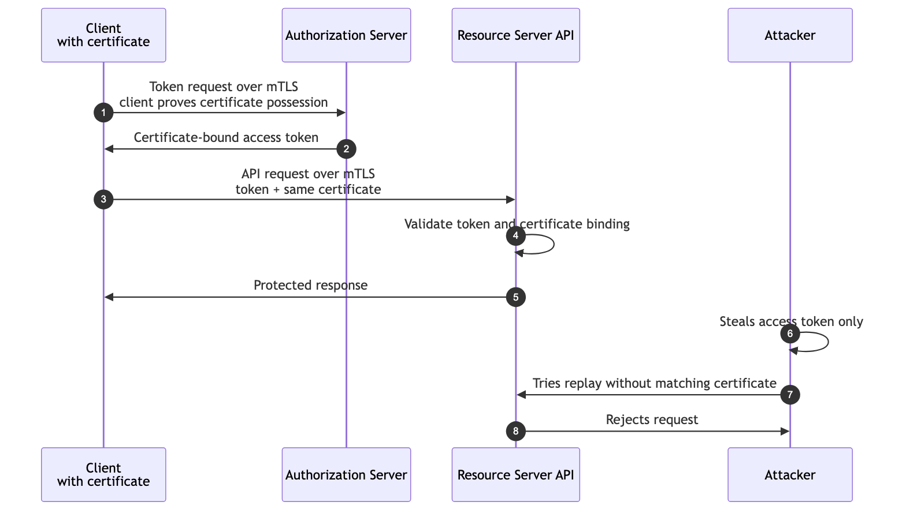

```{=latex}
\makelessoncover{7}{OAuth 2.0: Advanced Controls — PAR, JAR, JARM, DPoP, and mTLS}
```

# Learning Goal

This module explains advanced OAuth controls that harden authorization requests, authorization responses, and token use.

After this lesson, you should be able to:

- Compare PAR, JAR, and JARM.
- Explain why not everything should travel through the browser.
- Explain what signatures protect in authorization requests and responses.
- Explain bearer token replay.
- Explain DPoP and mTLS in practical terms.
- Explain what changes at the resource server when tokens are sender-constrained.

# 1. Why Advanced Controls Exist

Basic OAuth flows can be secure when implemented correctly.

Advanced controls appear when the risk is higher:

- The authorization request contains sensitive or high-value details.
- Browser/front-channel exposure is unacceptable.
- Request or response parameters must be protected from tampering.
- Bearer token replay risk is too high.
- Stronger client authentication is required.
- APIs need stronger auditability and interoperability.

# 2. PAR, JAR, and JARM Map

{width=100%}

# 3. PAR: Pushed Authorization Requests

PAR moves authorization request details from the browser/front-channel to a protected back-channel.

With PAR:

1. Client sends request details directly to the authorization server's PAR endpoint.
2. Authorization server validates and stores the request details.
3. Authorization server returns a `request_uri`.
4. Browser redirect carries the `request_uri`.
5. Authorization server resolves the stored request details.

Why it helps:

- Less sensitive detail travels through the browser.
- The authorization server receives request details directly from the client.
- Request details can be authenticated before the user redirect.

Standard reference: RFC 9126.

# 4. JAR: JWT-Secured Authorization Request

JAR packages authorization request parameters inside a JWT.

That request object can be signed and, in some deployments, encrypted.

JAR protects request integrity.

It can protect fields such as:

- `client_id`
- `redirect_uri`
- `scope`
- `aud`
- `response_type`
- `code_challenge`
- request-specific claims

Standard reference: RFC 9101.

# 5. JARM: JWT-Secured Authorization Response Mode

JARM packages authorization response parameters inside a JWT.

The response JWT can be signed and optionally encrypted.

JARM protects response integrity and can help with:

- Sender authentication.
- Audience restriction.
- Mix-up protection.
- Detecting response tampering.

Standard reference: OpenID Foundation JARM final specification.

# 6. PAR vs JAR vs JARM

| Control | Protects | Where It Applies |
|---|---|---|
| PAR | Request exposure in the browser. | Before authorization redirect. |
| JAR | Authorization request integrity. | Request parameters. |
| JARM | Authorization response integrity. | Response from authorization server to client. |

Short version:

- **PAR** pushes request details through the back-channel.
- **JAR** signs the request.
- **JARM** signs the response.

# 7. Bearer Token Replay vs DPoP

{width=100%}

# 8. DPoP in Practical Terms

DPoP stands for Demonstrating Proof of Possession.

DPoP is an application-level mechanism for sender-constraining OAuth tokens.

Without DPoP:

> Whoever holds the bearer token may be able to use it.

With DPoP:

> The caller must send the token plus a signed proof for this HTTP request.

The resource server checks:

1. The access token is valid.
2. The token is bound to a key.
3. The request includes a DPoP proof.
4. The proof is signed by the matching private key.
5. The proof matches the HTTP method and URL.

Standard reference: RFC 9449.

# 9. mTLS in Practical Terms

mTLS means mutual TLS.

Normal TLS proves the server identity to the client.

mTLS also proves the client identity to the server using a client certificate.

In OAuth, mTLS can be used for:

- Strong client authentication.
- Certificate-bound access tokens.

Practical meaning:

> A stolen token is less useful if the attacker cannot also present the correct client certificate.

Standard reference: RFC 8705.

# 10. mTLS Sender Constraint Diagram

{width=100%}

# 11. DPoP vs mTLS

| Topic | DPoP | mTLS |
|---|---|---|
| Proof type | Application-layer signed proof. | TLS-layer client certificate. |
| Common fit | Public clients, APIs, browser-adjacent clients when supported. | Backend/confidential clients and high-security environments. |
| Token binding | Bound to a public key. | Bound to a client certificate. |
| Operational complexity | Requires DPoP proof generation and validation. | Requires certificate issuance, storage, and rotation. |

Both reduce bearer token replay.

# 12. What Changes at the Resource Server?

With normal bearer tokens, the resource server mainly validates the token.

With sender-constrained tokens, the resource server must validate both:

1. The token.
2. The proof that the caller is the rightful sender.

For DPoP, that means validating the DPoP proof.

For mTLS, that means validating the certificate binding.

# 13. Standards Reference

- **[RFC 9126: Pushed Authorization Requests (PAR)](https://www.rfc-editor.org/rfc/rfc9126)**  
  Defines the PAR endpoint and `request_uri` pattern.

- **[RFC 9101: JWT-Secured Authorization Request (JAR)](https://www.rfc-editor.org/rfc/rfc9101)**  
  Defines signed JWT authorization request objects.

- **[OpenID Foundation JARM Final Specification](https://openid.net/specs/oauth-v2-jarm-final.html)**  
  Defines JWT-secured authorization responses.

- **[RFC 9449: Demonstrating Proof of Possession (DPoP)](https://www.rfc-editor.org/rfc/rfc9449)**  
  Defines application-level sender-constrained tokens.

- **[RFC 8705: OAuth 2.0 Mutual TLS](https://www.rfc-editor.org/rfc/rfc8705)**  
  Defines mutual-TLS client authentication and certificate-bound tokens.

# 14. Discussion Questions

1. Why is browser/front-channel exposure risky?
2. When would PAR be more useful than a normal authorization request?
3. What does JAR sign?
4. What does JARM sign?
5. Why does DPoP reduce token replay?
6. What operational challenge does mTLS introduce?

# 15. Definition of Done

You are ready to move on when you can:

- Compare PAR, JAR, and JARM.
- Explain DPoP and mTLS in practical terms.
- Explain bearer token replay.
- Explain how sender-constrained tokens change resource-server validation.
- Choose which advanced control solves which problem.

# Appendix: Slide Outline

1. Why advanced OAuth controls exist
2. PAR, JAR, and JARM map
3. PAR: move request details back-channel
4. JAR: sign the request
5. JARM: sign the response
6. Bearer token replay vs DPoP
7. mTLS sender constraint
8. DPoP vs mTLS
9. Resource server validation changes
