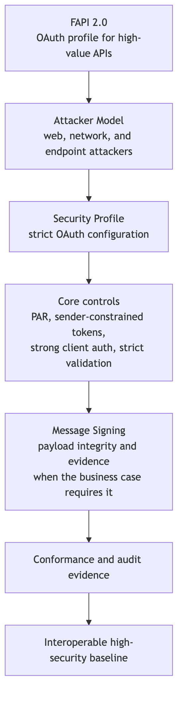
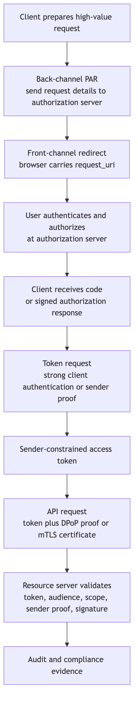

```{=latex}
\makelessoncover{8}{OAuth 2.0: FAPI 2.0}
```

# Learning Goal

FAPI 2.0 is more complicated than a single OAuth extension.

It is a high-security API profile that combines OAuth, attacker-model thinking, strict configuration, sender-constrained tokens, PAR, and optional message signing for high-value APIs.

After this lesson, you should be able to:

- Explain FAPI as stricter OAuth, not a separate replacement protocol.
- Explain why high-value APIs need stronger controls.
- Identify the role of the FAPI 2.0 Security Profile.
- Explain the purpose of the FAPI 2.0 Attacker Model.
- Explain when FAPI 2.0 Message Signing matters.
- Map FAPI controls to attacks.
- Review a high-value API architecture for missing controls.

# 1. What FAPI 2.0 Is

FAPI originally meant Financial-grade API, but the pattern is useful beyond banking.

FAPI 2.0 is an API security profile suitable for high-security applications based on OAuth 2.0.

Use cases include:

- Open banking.
- Payments.
- Healthcare.
- Sensitive identity APIs.
- Government or regulated data APIs.
- Any API where abuse has high business, legal, or safety impact.

Important:

> FAPI is stricter OAuth, not a separate replacement protocol.

# 2. Why FAPI Is More Than One Feature

FAPI is not just "use PKCE" or "use mTLS".

It combines:

- Strict OAuth configuration.
- Strong attacker assumptions.
- Authorization request protection.
- Sender-constrained tokens.
- Strict token validation.
- Strong client authentication.
- Optional message signing for non-repudiation or payload integrity.
- Conformance and interoperability expectations.

# 3. FAPI 2.0 Controls Map

{width=100%}

# 4. Why High-Value APIs Need More Controls

High-value APIs have stronger attacker incentives and higher business impact.

Risks matter more:

- Redirect manipulation.
- Token replay.
- Weak client authentication.
- Authorization request tampering.
- Authorization response tampering.
- Poor token validation.
- Missing audit evidence.
- Disputes about who authorized or sent a message.

FAPI responds by requiring or expecting stricter patterns.

# 5. FAPI 2.0 Security Profile

The FAPI 2.0 Security Profile gives implementation guidance for high-security OAuth-based APIs.

It narrows choices and removes unsafe flexibility.

Typical themes:

- Use secure OAuth flows.
- Use PAR for request protection.
- Use sender-constrained tokens.
- Require strict redirect and token validation behavior.
- Use stronger client authentication where appropriate.
- Align clients, authorization servers, and resource servers around interoperable behavior.

Participant mental model:

> Normal OAuth gives options. FAPI chooses stricter options for high-value APIs.

# 6. FAPI 2.0 Attacker Model

The attacker model explains what kind of attacker FAPI is designed against.

It assumes powerful attackers and considers different positions in the flow, such as:

- Web attackers.
- Network attackers.
- Attackers at the authorization endpoint.
- Attackers at the token endpoint.
- Attackers at the resource server.

Why this matters:

> FAPI controls are not random. They are selected to defend against strong attacker capabilities.

# 7. FAPI 2.0 Message Signing

FAPI 2.0 Message Signing is used when API requests or responses need stronger integrity, authenticity, or non-repudiation properties.

Message signing is especially relevant when:

- The API action has financial or legal impact.
- A payment instruction must not be tampered with.
- A party may later need to prove exactly what was authorized or sent.
- The system needs signed evidence beyond transport security.

Transport security protects the channel.

Message signing protects the message.

# 8. High-Value API Architecture

{width=100%}

# 9. Secure Open Banking Flow Example

Example high-level flow:

1. Client prepares payment or account-access request.
2. Client sends request details through PAR.
3. Authorization server returns a `request_uri`.
4. User is redirected to the authorization server.
5. User authenticates and authorizes the action.
6. Client receives a protected authorization response.
7. Client exchanges code at the token endpoint using strong client authentication.
8. Authorization server issues a sender-constrained access token.
9. Client calls bank API with token plus sender proof.
10. Resource server validates token, audience, scope, sender proof, and any message signature.
11. Logs and audit evidence are retained for compliance and dispute handling.

# 10. FAPI Controls Mapped to Attacks

| Attack or Risk | FAPI-Oriented Control |
|---|---|
| Authorization request tampering | PAR and signed request objects. |
| Sensitive request details exposed in browser | PAR. |
| Authorization response tampering | Signed authorization responses when used. |
| Bearer token replay | Sender-constrained tokens such as DPoP or mTLS. |
| Weak client authentication | Strong client authentication, often private key or certificate based. |
| Token accepted by wrong API | Strict audience validation. |
| Expired or invalid token accepted | Strict token validation. |
| Payment or consent dispute | Message signing and audit evidence where required. |

# 11. Architecture Review Checklist

Use this checklist when reviewing a high-value API architecture:

- Is the API high-value enough to justify FAPI-style controls?
- Is the client public or confidential?
- Is PAR used to reduce front-channel request exposure?
- Is PKCE used where appropriate?
- Are redirect URIs exact and pre-registered?
- Is client authentication strong enough?
- Are access tokens sender-constrained?
- Are tokens validated for issuer, audience, expiry, signature, scope, and key?
- Is token replay possible?
- Is message signing needed for non-repudiation or payload integrity?
- Is audit evidence retained?
- Can the implementation pass conformance testing?

# 12. What FAPI Is Not

FAPI is not:

- A replacement for OAuth.
- A new login protocol.
- A single flow.
- Only for banks.
- Automatically secure without correct implementation.

FAPI is:

> A strict profile and security architecture for using OAuth in high-value API ecosystems.

# 13. Standards Reference

- **[FAPI 2.0 Security Profile](https://openid.net/specs/fapi-security-profile-2_0.html)**  
  OpenID Foundation final specification for high-security OAuth API profiles.

- **[FAPI 2.0 Attacker Model](https://openid.net/specs/fapi-attacker-model-2_0-final.html)**  
  OpenID Foundation final specification describing security goals, attacker roles, and attacker capabilities.

- **[FAPI 2.0 Message Signing](https://openid.net/specs/fapi-message-signing-2_0-final.html)**  
  OpenID Foundation final specification for signing and verifying selected FAPI request/response messages.

- **[RFC 6749: OAuth 2.0 Authorization Framework](https://www.rfc-editor.org/rfc/rfc6749)**  
  The OAuth foundation FAPI builds on.

- **[RFC 9126: PAR](https://www.rfc-editor.org/rfc/rfc9126)**  
  A key building block used by FAPI-style profiles.

- **[RFC 9449: DPoP](https://www.rfc-editor.org/rfc/rfc9449)** and **[RFC 8705: mTLS](https://www.rfc-editor.org/rfc/rfc8705)**  
  Sender-constrained token mechanisms.

# 14. Discussion Questions

1. Why is FAPI described as stricter OAuth?
2. Which risks matter more for high-value APIs?
3. Why does FAPI care about an attacker model?
4. Why does PAR matter for high-value authorization requests?
5. What does sender-constrained token use reduce?
6. When would message signing be required?
7. What evidence would you collect to prove compliance?

# 15. Definition of Done

You are ready to finish the roadmap when you can:

- Describe FAPI as stricter OAuth.
- Explain the Security Profile, Attacker Model, and Message Signing at a high level.
- Map FAPI controls to attacks.
- Draw a high-value API architecture.
- Review an OAuth architecture and point out missing FAPI-style controls.

# Appendix: Slide Outline

1. Why FAPI exists
2. FAPI is stricter OAuth
3. High-value API risks
4. FAPI 2.0 controls map
5. Security Profile
6. Attacker Model
7. Message Signing
8. High-value API architecture
9. Secure open banking flow
10. Controls mapped to attacks
11. Architecture review checklist
